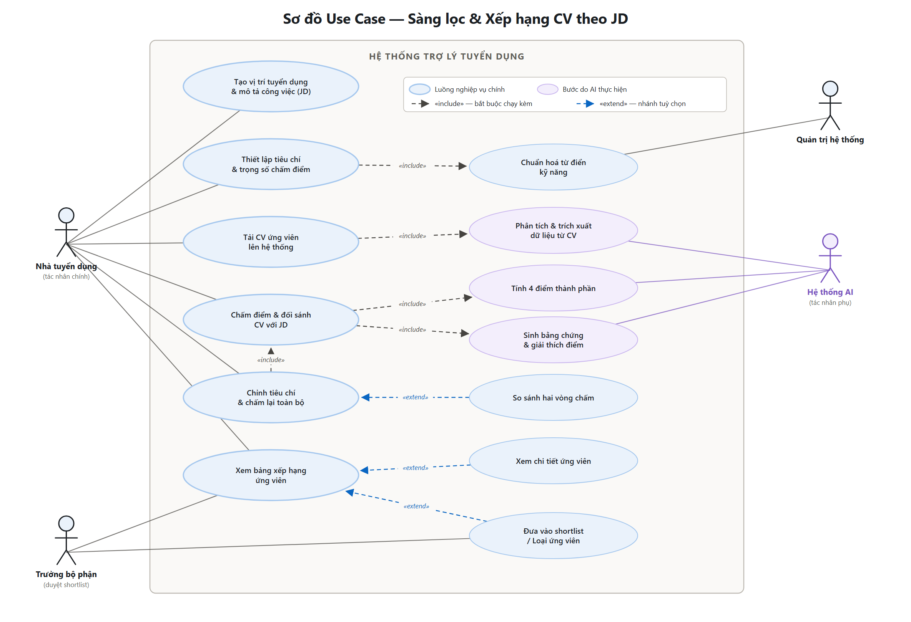
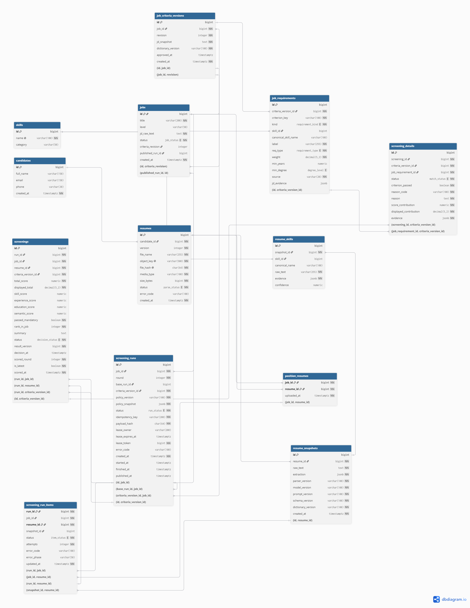
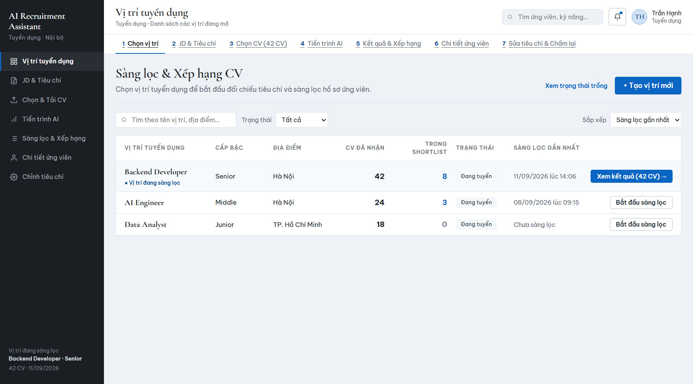
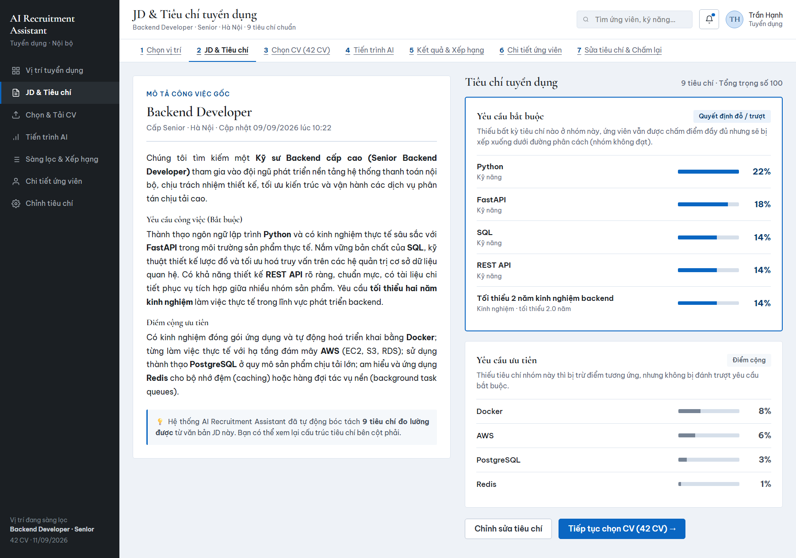
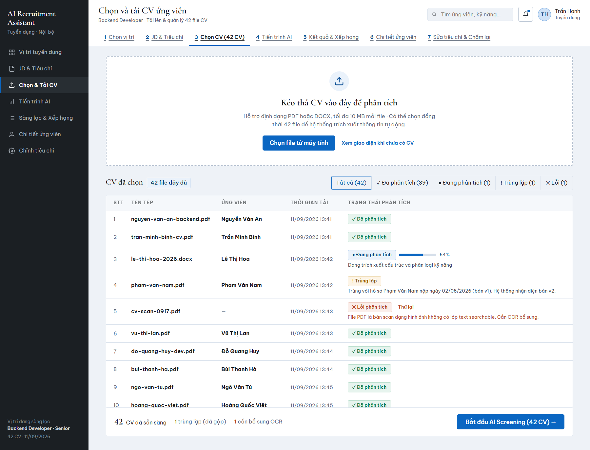
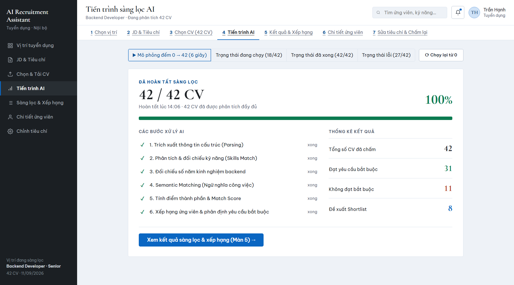
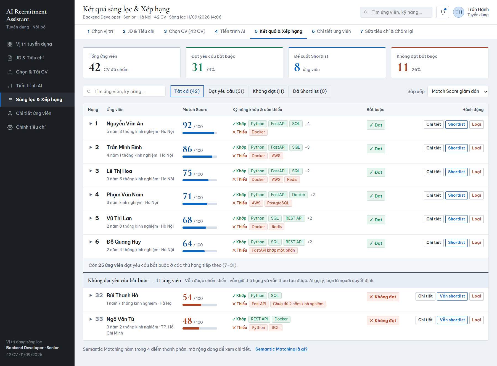
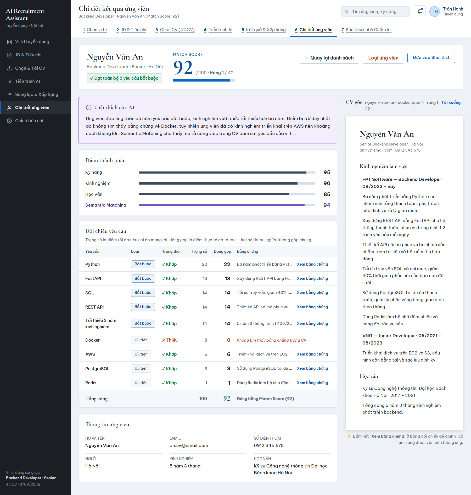
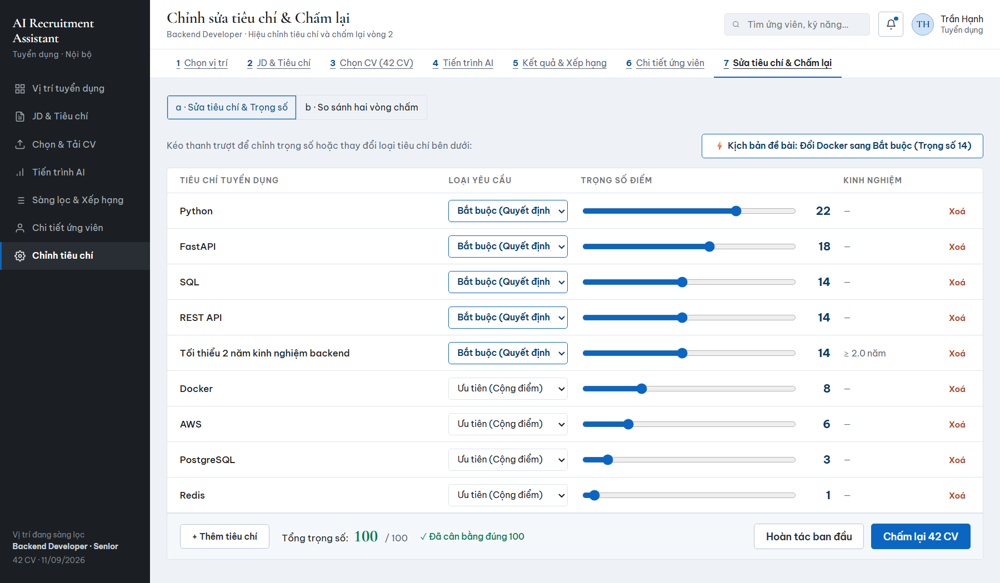

# AI Recruitment Assistant — Screening & Candidate Ranking System

An explainable recruitment assistant concept for resume screening and candidate ranking based on Job Descriptions (JD). It aims to reduce manual screening effort and make results inspectable through evidence; the prototype does not establish real-world AI accuracy or bias reduction.

The current deliverable is an interactive **HTML5, Vanilla CSS, and ES6 JavaScript prototype**, with zero build steps and sample data held in memory. It does not implement real CV parsing, AI calls, a backend, or database persistence. The relational schema is a design artifact.

> **Architecture documentation:** [C1–C3, arc42, deployment and three sequence diagrams](docs/architecture/README.md) document a **proposed implementation** of the selected JD-based CV screening and ranking workflow. Backend services, API contracts, storage and schema extensions in that documentation are not yet implemented. Feature descriptions below describe the intended workflow and its UI simulation, not verified production capabilities.

---

## 1. Project Overview & Core Workflow

In modern recruitment campaigns, talent acquisition teams often receive hundreds of CVs per opening. Traditional manual screening is slow, inconsistent, and prone to fatigue. Conversely, generic AI screening tools act as opaque "black boxes" that recruiters cannot trust.

This project delivers a **focused, high-impact business workflow** that directly proves the value of AI in recruitment:

```
Create Job & Ingest JD ➔ Extract Criteria ➔ Bulk Upload CVs ➔ Multi-Factor AI Scoring ➔ Ranked Leaderboard ➔ Audit Evidence & Shortlist
```

### Why this specific workflow?
This is the single recruitment workflow that **cannot be replaced by spreadsheets**:
- Ingesting 40+ multi-format CVs and returning the top ranked candidates with mathematical precision.
- Backing every score with verifiable citations directly linked to the candidate's original resume text.
- Allowing instant "what-if" simulations by tweaking criteria weights and recalculating rankings on the fly.

---

## 2. System Mindmap & Scope Definition

The system architecture is derived from a 7-branch recruitment mindmap, isolating the critical screening flow and its underlying dependencies while explicitly scoping out ancillary HR administrative features.

### System Mindmap Diagram


### Use Case Diagram — Screening & Ranking

The deep-dive function is modelled below. `«include»` marks steps that always run as part of
the base use case; `«extend»` marks optional branches the recruiter may invoke from the ranking
table. Purple ellipses are steps executed by the AI actor rather than a human.



| Actor | Role |
| :--- | :--- |
| **Nhà tuyển dụng** (Recruiter) | Primary actor — creates the requisition, sets criteria & weights, uploads CVs, triggers screening and rescoring, reads the ranking. |
| **Trưởng bộ phận** (Hiring Manager) | Reviews the ranking and approves/rejects the shortlist. |
| **Hệ thống AI** (AI Engine) | Secondary actor — CV parsing & extraction, the 4 sub-scores, evidence and explanation generation. |
| **Quản trị hệ thống** (Administrator) | Maintains the normalized skill dictionary the criteria matching depends on. |

### Functional Scope Matrix

| Mindmap Module | In-Scope Features (Designed / UI Simulation) | Deliberately Out-of-Scope |
| :--- | :--- | :--- |
| **1. Job Management** (*Quản lý vị trí*) | Job requisition creation/editing, raw JD ingestion, automated criteria extraction, mandatory vs. preferred rule formulation, opening/closing job positions. | Job cloning / duplication. |
| **2. CV Management** (*Quản lý CV*) | Bulk multi-file upload, entity & skill extraction, duplicate CV detection (`file_hash` SHA-256), multi-version resume tracking (`version`). | CV repository semantic search across all historical campaigns. |
| **3. Screening & Ranking** (*Sàng lọc & Xếp hạng*) | **100% In-Scope**: Mandatory knockout filtering, multi-factor weighted scoring, explainable score breakdown with missing skills identification, candidate ranking, shortlisting/rejection, dynamic rescoring upon criteria updates. | Semantic embedding matching via `pgvector` (schema column reserved; simulated in current release). |
| **4. Candidate Management** (*Quản lý ứng viên*) | Full candidate profiles, application status transitions (*Scoring*, *Scored*, *Shortlisted*, *Rejected*), multi-round scoring history. | Candidate side-by-side comparison matrix, internal collaborative recruiter notes. |
| **5. Interview Support** (*Hỗ trợ phỏng vấn*) | — | Complete module (interview kit generator, scheduling, scorecards). |
| **6. Analytics & Reports** (*Thống kê & Báo cáo*) | — | Complete module (channel attribution, demographic diversity reports). |
| **7. System & Permissions** (*Hệ thống & Phân quyền*) | — | Complete module (multi-tenant RBAC, audit logs, authentication). |

---

## 3. Core System Features

The system is structured into 4 core functional pillars:

### 3.1 Job Requisition & Criteria Extraction (`jobs`, `job_requirements`)
- **Job Requisition Management**: Manages campaign status (`draft`, `open`, `closed`), seniority level, location, and tracks recruitment pipeline metrics.
- **Raw JD Ingestion**: Preserves the original unparsed Job Description (`jd_raw_text`) to allow human auditors to verify criteria extraction accuracy.
- **AI-Assisted Criteria Extraction**: Automatically parses unstructured JD text into structured requirements categorized into:
  1. **Mandatory Criteria**: Hard knockout rules (e.g., *≥ 4 years Node.js, Microservices experience, Computer Science Degree*). Failure to satisfy any mandatory criterion flags the applicant as disqualified (`passed_mandatory = false`).
  2. **Preferred Criteria**: Weighted bonus criteria (e.g., *Golang, Docker/Kubernetes, CI/CD, English fluency*).
- **Customizable Weight Sliders**: Each criterion carries an adjustable numeric weight (`weight`), strictly validated to sum to 100%.

### 3.2 CV Management & Normalized Parsing (`resumes`, `resume_skills`, `skills`)
- **Multi-Format Ingestion Pipeline**: Ingests batches of resumes across multiple states:
  - *Parsed*: Content normalized and extracted.
  - *Parsing*: Asynchronous file processing stream.
  - *Duplicate*: Detected via cryptographic SHA-256 content hashing (`file_hash`) or candidate email deduplication.
  - *Parsing Error*: Flagged for OCR or file corruption anomalies.
- **Centralized Skills Dictionary (`skills`)**: Resolves nomenclature variations (e.g., "ReactJS", "React.js", "react" map to standardized canonical skill `React`) to ensure deterministic matching.
- **Multi-Version Tracking (`resumes.version`)**: Enables a candidate to submit updated resumes across multiple job postings without overwriting previous submission records.

### 3.3 AI Screening & Ranking Engine (`screenings`, `screening_details`)
- **Two-Stage Multi-Factor Evaluation**:
  - **Stage 1 — Hard Knockout Filter**: Validates mandatory qualifications. Disqualified candidates are preserved in the system but routed below a visual demarcation line on the leaderboard.
  - **Stage 2 — Multi-Component Scoring**:
    ```text
    total_score = 0.55 * skill + 0.30 * experience + 0.15 * education
    ```
    *(Or `0.45 * skill + 0.25 * exp + 0.10 * edu + 0.20 * semantic` when semantic embeddings are active).*
- **Sub-Component Score Formulas**:
  - **Skill Score**:
    ```text
    skill_score = Σ(weight_i × match_level_i) / Σ(weight_i) × 100
    ```
    *(where `match_level` is 1.0 for Full Match, 0.5 for Partial Match, and 0.0 for Missing).*
  - **Experience Score**:
    ```text
    experience_score = min(candidates.years_experience / min_years, 1.25) × 80
    ```
  - **Education Score**: Lookup conversion mapped from `candidates.highest_degree`.
- **Explainable Audit Details (`screening_details`)**:
  - Each evaluated criterion stores its match status (`matched`, `partial`, `missing`), points contributed, and exact verbatim **evidence quotation** extracted from the CV.
- **Candidate Leaderboard**:
  - Displays candidates ranked in descending order of `total_score`.
  - In-line competency chips indicating matched and missing skills.
  - Dedicated **Knockout Demarcation Divider**: Disqualified applicants are clearly grouped beneath this line with an explicit reason banner, rather than silently deleted.
- **One-Click Candidate Actions**: Instant **Shortlist** (with ink-blue status `#1B3A63`) and **Reject** modals directly accessible from table rows.

### 3.4 Dynamic Rescoring & What-If Simulation (`scored_round`, `is_latest`)
- **Parameter Recalibration**: Recruiters can modify criteria weights or promote a preferred criterion to mandatory (e.g., toggling *Docker* to Mandatory).
- **Multi-Round Versioning**:
  - Automatically archives previous screening results (`is_latest = FALSE`).
  - Generates a new evaluation round (`scored_round = scored_round + 1, is_latest = TRUE`).
- **Comparative Diff Analysis**: Displays a side-by-side leaderboard comparison showing ranking shifts (e.g., top candidate drops from Rank 1 to Rank 20 below the divider due to a missing mandatory skill; overall passing count drops from 31 to 19).

---

## 4. Database Schema (ERD)

The database design is an 8-table normalised relational schema, not a connected persistence layer in the current prototype. It separates the **job side** (`jobs` → `job_requirements`), the **candidate side** (`candidates` → `resumes` → `resume_skills`), and the **evaluation side** (`screenings` → `screening_details`), with `skills` acting as the shared controlled vocabulary. The proposed architecture documents additional snapshot and task records needed for a real implementation; these have not been applied to the original DBML.



| Table | Role in the screening pipeline |
|---|---|
| `skills` | Canonical skill dictionary + alias normalisation (`Postgres` → `PostgreSQL`), so scoring never compares raw strings |
| `jobs` | Job position and its JD text |
| `job_requirements` | One row per criterion: weight, mandatory flag, link to a canonical skill |
| `candidates` | Candidate identity (deduplicated by email) |
| `resumes` | An uploaded CV file + its parsed/extracted payload |
| `resume_skills` | Skills extracted from a CV, with years of experience and evidence span |
| `screenings` | One scoring run of one CV against one job: 4 sub-scores, total, pass/fail, `scored_round`, `is_latest` |
| `screening_details` | Per-criterion breakdown: matched skill, contribution to the total, evidence quote — this table is what makes the ranking explainable |

Two design decisions are load-bearing:

- **`scored_round` + `is_latest`** — rescoring never overwrites history. A new round is inserted and the previous one is flagged `is_latest = FALSE`, which is what enables the side-by-side round comparison in §3.4.
- **`screening_details` stores evidence, not just numbers** — every point a candidate earns is traceable to a quoted span in their CV, satisfying the explainability requirement.

---

## 5. User Interface — Screen-by-Screen

Seven screens, driven by a hash router, following the recruiter's actual path: define the job → set criteria → upload CVs → let the AI score → read the ranking → inspect one candidate → recalibrate and rescore.

### 5.1 Vị trí tuyển dụng — Job Positions (`#vi-tri`)
Entry point. Lists open positions with their CV counts and screening status, so the recruiter picks a job before anything else happens.



### 5.2 JD & Tiêu chí — JD & Criteria (`#tieu-chi`)
The JD on the left, the extracted criteria on the right. Each criterion carries a **weight** and a **Bắt buộc / Ưu tiên** (mandatory / preferred) flag — these two fields alone determine both the score and who falls below the divider.



### 5.3 Chọn & Tải CV — Upload CVs (`#tai-cv`)
Batch selection of the CVs to screen (42 in the sample dataset), with per-file parse status before the scoring run is launched.



### 5.4 Tiến trình AI — AI Progress (`#tien-trinh`)
The scoring run made visible: per-stage progress (parsing → extraction → matching → scoring) instead of an opaque spinner, so a long batch stays legible.



### 5.5 Kết quả & Xếp hạng — Ranking (`#ket-qua`)
The core deliverable. Exactly six columns; sub-scores live in the expandable row, never in the header table. Candidates who fail a mandatory criterion are **not dropped** — they stay ranked below a divider, still fully actionable, because "failed" is a recruiter's judgement call, not the system's.



### 5.6 Chi tiết ứng viên — Candidate Detail (`#chi-tiet/:id`)
Per-criterion accountability: status, weight, contribution to the total, and the quoted evidence from the CV — with the original CV rendered alongside for verification.



### 5.7 Sửa tiêu chí & Chấm lại — Rescore (`#chinh-tieu-chi`)
What-if recalibration: change weights or promote a criterion to mandatory, rescore, and compare the new round against the previous one to see exactly which rankings moved and why.



> **Colour is never the only signal.** Every state in these screens is carried by colour *and* an icon *and* a text label (and, for scores, bar length), so the interface stays readable for colour-blind users and in greyscale print.

---

## 6. How to Run (Zero Dependencies / Zero Setup)

The application is completely standalone and requires **no Node.js build steps, no package installations, and no compiler configuration**.

### Method 1: Direct File Launch (Quickest)
Simply double-click **`index.html`** in your file manager to open the prototype directly in any modern browser (Chrome, Edge, Firefox, Safari).

### Method 2: Local HTTP Server
Run using any standard local development server:

**Using Node.js:**
```bash
npx serve .
# or
npx http-server . -p 8080
```

**Using Python:**
```bash
python -m http.server 8080
```

Open your browser and navigate to: **`http://localhost:8080`**

---

## 7. Repository Structure

```
recruitment-assistant/
├── index.html                   # Single-Page Application shell with hash router & modals
├── README.md                    # System documentation, mindmap & architectural specifications
├── sang-loc-xep-hang-v2.dbml    # DBML source of the 8-table relational schema
├── css/
│   ├── tokens.css               # Design system variables (colors, typography, spacing)
│   └── app.css                  # Application layouts, responsive tables & animations
├── js/
│   ├── data.js                  # Relational mock database (jobs, criteria, 42 CVs, scores)
│   └── app.js                   # In-memory reactive state manager, router & screen renderers
└── docs/
    ├── architecture/            # Proposed C1–C3, arc42, deployment and 3 runtime sequences
    ├── mindmap.png              # 7-branch recruitment system mindmap
    ├── use-case-diagram.svg     # UML use case diagram — screening & ranking (source)
    ├── use-case-diagram.png     # UML use case diagram — rendered
    ├── database-design-erd.png  # 8-table relational database architecture diagram
    └── screenshots/             # Captures of all 7 UI screens (embedded in §5)
        ├── 01-job-positions.png
        ├── 02-jd-criteria.png
        ├── 03-upload-cv.png
        ├── 04-ai-progress.png
        ├── 05-ranking.png
        ├── 06-candidate-detail.png
        └── 07-rescore.png
```

---

## 8. Architecture — Selected Screening Workflow

The architecture covers JD/criteria, CV ingestion, screening, ranking, evidence review, shortlist/rejection and rescoring. Interview scheduling, offers, HR administration and recruitment-wide reporting remain outside scope.

- [Architecture guide and implementation status](docs/architecture/README.md)
- [arc42 — all 12 sections](docs/architecture/arc42.md)
- [C1 — System Context](docs/architecture/c1-context.md)
- [C2 — Containers](docs/architecture/c2-containers.md)
- [C3 — Screening Backend Components](docs/architecture/c3-components.md)
- [Deployment — proposed internal test environment](docs/architecture/deployment.md)
- [Sequence 1 — JD setup and initial screening](docs/architecture/sequence-01-screening.md)
- [Sequence 2 — Evidence review and shortlist/rejection](docs/architecture/sequence-02-review.md)
- [Sequence 3 — Criteria changes and rescoring](docs/architecture/sequence-03-rescore.md)

*Academic Capstone Project — Intelligent Recruitment Screening & Explainable Candidate Ranking System.*
