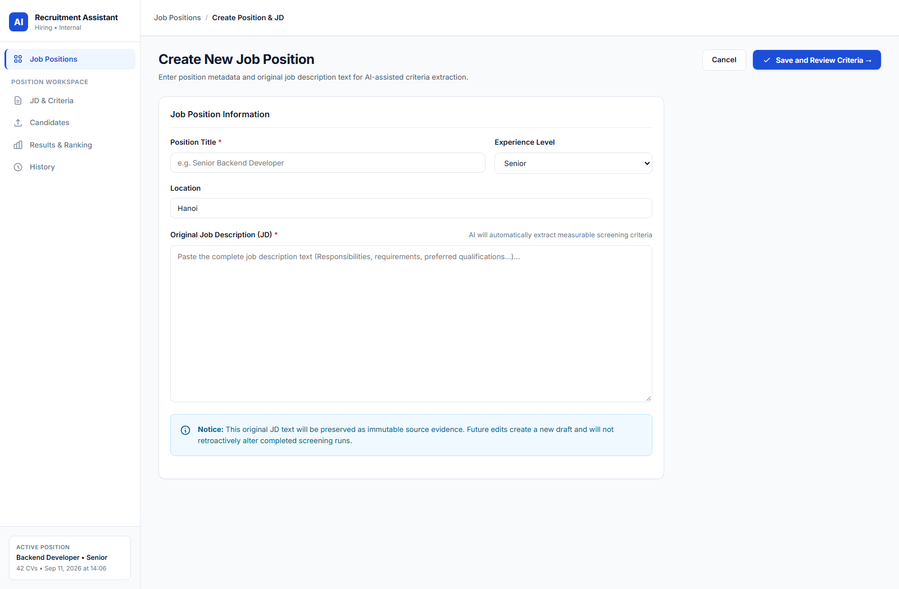
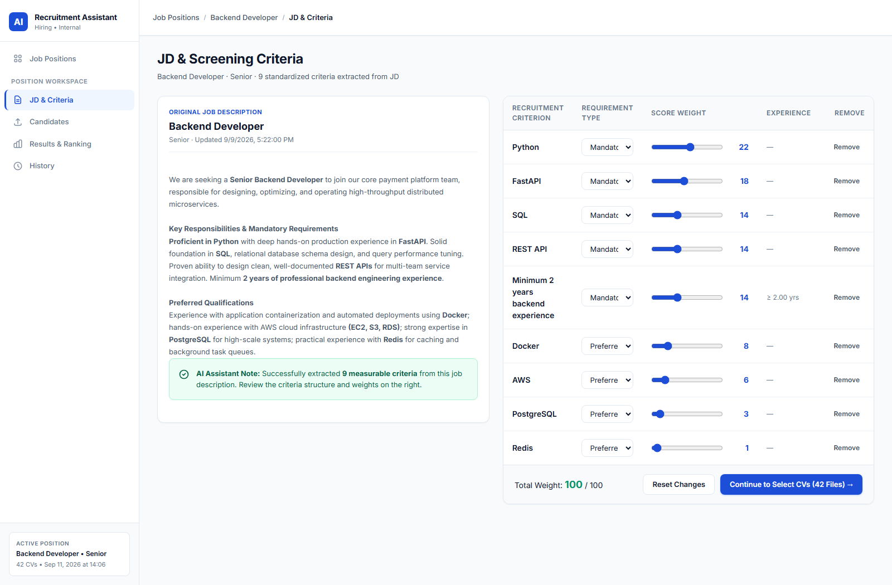
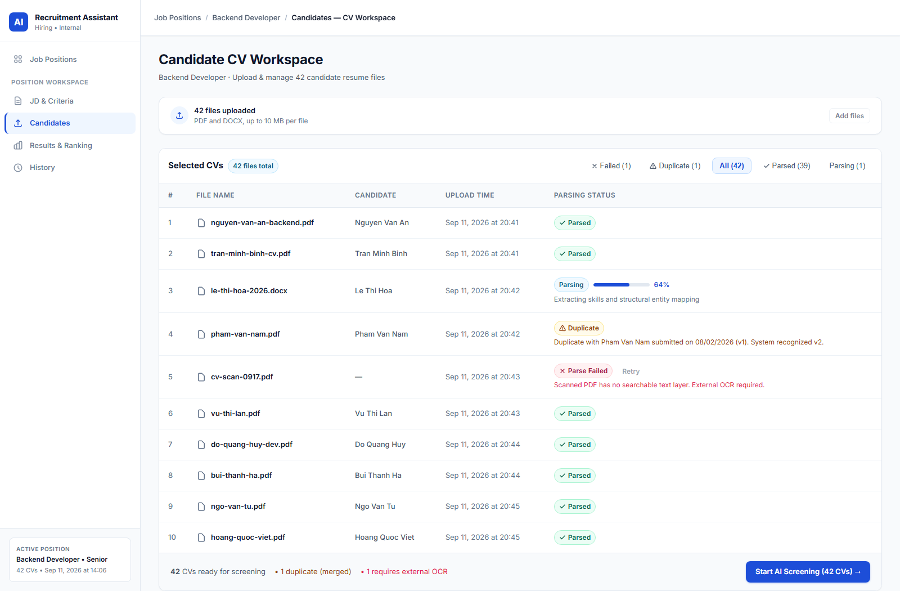
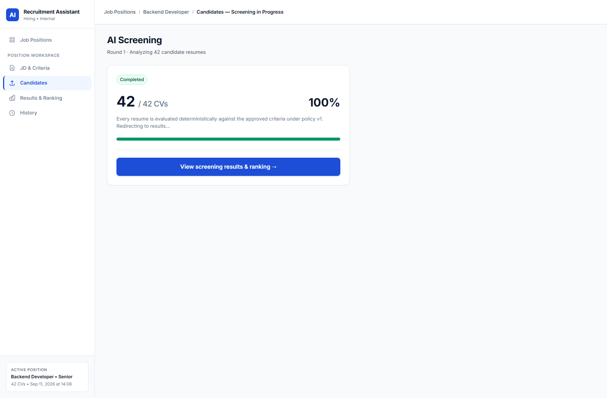
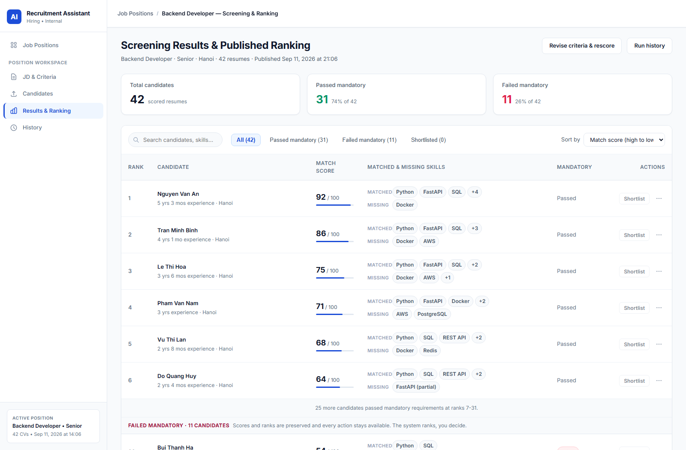
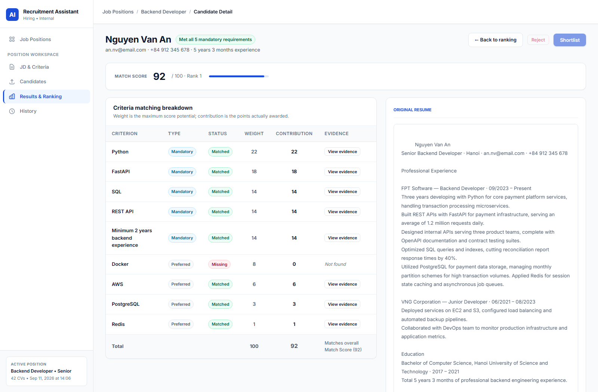
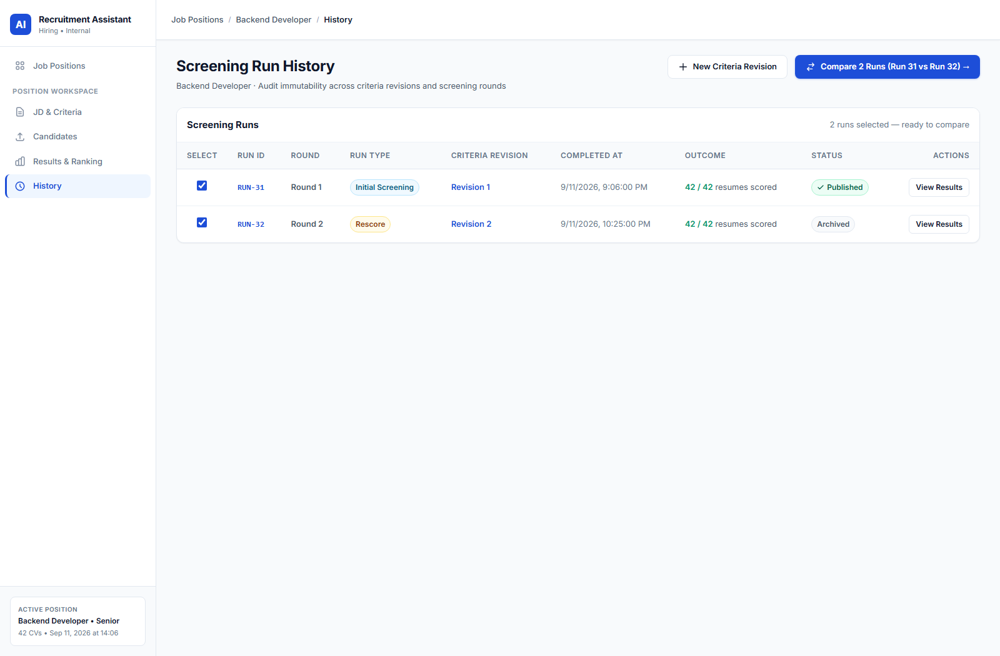
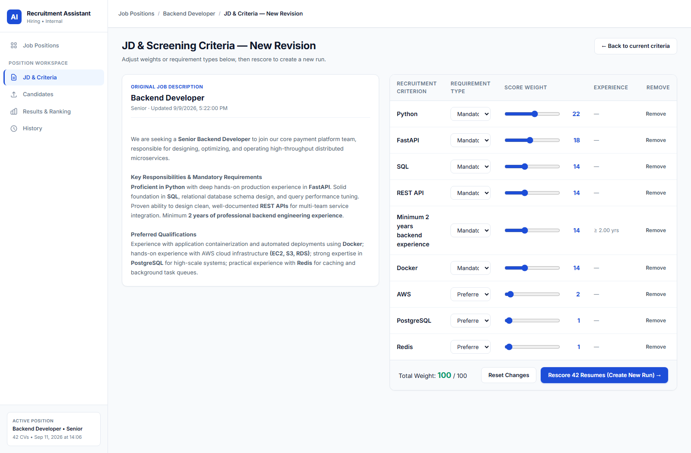
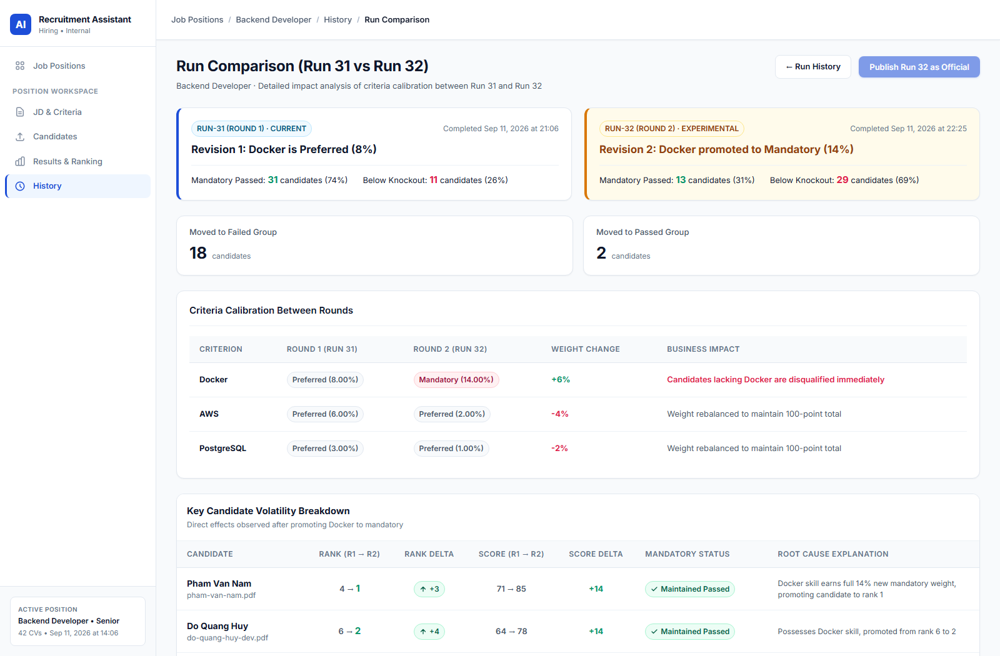

# AI Recruitment Assistant — Screening & Candidate Ranking System

API contract: [OpenAPI 3.0.3](docs/api/openapi.yaml) · [API guide and requirements mapping](docs/api/README.md) · [Next.js backend decision](docs/architecture/nextjs-backend.md).

An explainable recruitment assistant concept for resume screening and candidate ranking based on Job Descriptions (JD). It aims to reduce manual screening effort and make results inspectable through evidence; the prototype does not establish real-world AI accuracy or bias reduction.

The repository contains a **TypeScript API with in-memory repositories and mock extraction** and a frontend connected to that API across ten screens. The original standalone HTML/CSS/JavaScript prototype was removed in commit `9cafcbf` (2026-09-17) and remains only in Git history. Scoring is deterministic backend code; AI is used only as an extraction interface. The local workflow uses a single Node process for API and background jobs.

> **Design documentation:** [Architecture](docs/architecture/README.md) covers C1–C3, arc42, deployment, and sequence diagrams. [UI/UX design](docs/ui-ux/README.md) covers the target information architecture, screen hierarchy, flows, and screen specifications. Both describe the selected JD-based CV screening and ranking workflow. The API and all ten screens are implemented; PostgreSQL, real document parsing and the AI provider are not, so the specified behavior is not fully met yet — see the [Phase 3 verification](docs/ui-ux/phase-3-verification.md).

---

## 1. Project Overview & Core Workflow

In modern recruitment campaigns, talent acquisition teams often receive hundreds of CVs per opening. Traditional manual screening is slow, inconsistent, and prone to fatigue. Conversely, generic AI screening tools act as opaque "black boxes" that recruiters cannot trust.

This project delivers a **focused, high-impact business workflow** that directly proves the value of AI in recruitment:

```
Create Job & Ingest JD ➔ Confirm Criteria ➔ Bulk Upload CVs ➔ Deterministic Scoring ➔ Ranked Leaderboard ➔ Audit Evidence & Shortlist
```

### Why this specific workflow?
The target workflow combines bulk CV ingestion, reproducible scoring and inspectable evidence:
- Rank batches of CVs against the same approved criteria.
- Explain criterion matches through quotations from the original resume text.
- Recalculate with a new criteria revision while preserving historical results.

---

## 2. System Mindmap & Scope Definition

The system architecture is derived from a 7-branch recruitment mindmap, isolating the critical screening flow and its underlying dependencies while explicitly scoping out ancillary HR administrative features.

### System Mindmap Diagram


### Use Case Diagram — Screening & Ranking

The use cases below follow the proposed arc42 scope and policy v1. The requirements are documented as [17 INVEST user stories with acceptance criteria](docs/requirements/README.md), with a [use-case catalog and migration from the earlier diagram](docs/requirements/use-cases.md). They describe target behaviour. How far the implementation has been verified against them is recorded in the [Phase 3 verification](docs/ui-ux/phase-3-verification.md).


Both Recruiter symbols represent the same actor. AI assists JD/CV extraction; the backend validates evidence and computes skill, experience and education scores. Semantic scoring is not applied in v1. The original mindmap and broad feature descriptions below remain historical context; arc42 and the requirements define the selected implementation scope.

| Actor | Role |
| :--- | :--- |
| **Recruiter** | Direct user — creates the JD, approves criteria, uploads CVs, starts screening/rescoring, reviews evidence, shortlists/rejects, and compares historical runs. |
| **External AI Service** | Supporting actor — extracts JD/CV data with source evidence; does not assign scores or make hiring decisions. |

A separate hiring-manager approval workflow and a skill-dictionary administration screen are outside v1. Skill aliases use versioned configuration inside the system.

### Functional Scope Matrix

| Mindmap Module | In-Scope Features (Designed / UI Simulation) | Deliberately Out-of-Scope |
| :--- | :--- | :--- |
| **1. Job Management** | Job requisition creation/editing, raw JD ingestion, automated criteria extraction, mandatory vs. preferred rule formulation, opening/closing job positions. | Job cloning / duplication. |
| **2. CV Management** | Bulk multi-file upload, entity & skill extraction, duplicate CV detection (`file_hash` SHA-256), multi-version resume tracking (`version`). | CV repository semantic search across all historical campaigns. |
| **3. Screening & Ranking** | Mandatory eligibility grouping, multi-factor weighted scoring, explainable score breakdown with missing skills identification, candidate ranking, shortlisting/rejection, rescoring upon criteria updates. | Semantic embedding matching via `pgvector`; policy v1 leaves `semantic_score` null. |
| **4. Candidate Management** | Full candidate profiles, application status transitions (*Scoring*, *Scored*, *Shortlisted*, *Rejected*), multi-round scoring history. | Candidate side-by-side comparison matrix, internal collaborative recruiter notes. |
| **5. Interview Support** | — | Complete module (interview kit generator, scheduling, scorecards). |
| **6. Analytics & Reports** | — | Complete module (channel attribution, demographic diversity reports). |
| **7. System & Permissions** | — | Complete module (multi-tenant RBAC, audit logs, authentication). |

---

## 3. Core System Features

The target system has four core functional pillars.

### 3.1 Job Requisition & Criteria Extraction (`jobs`, `job_requirements`)
- **Job Requisition Management**: Manages campaign status (`draft`, `open`, `closed`), seniority level, and tracks recruitment pipeline metrics.
- **Raw JD Ingestion**: Preserves the original unparsed Job Description (`jd_raw_text`) to allow human auditors to verify criteria extraction accuracy.
- **AI-Assisted Criteria Extraction**: Automatically parses unstructured JD text into structured requirements categorized into:
  1. **Mandatory Criteria**: Hard knockout rules (e.g., *≥ 4 years Node.js, Microservices experience, Computer Science Degree*). Failure to satisfy any mandatory criterion flags the applicant as disqualified (`passed_mandatory = false`).
  2. **Preferred Criteria**: Weighted bonus criteria (e.g., *Golang, Docker/Kubernetes, CI/CD, English fluency*).
- **Customizable Weight Sliders**: Each criterion carries an adjustable numeric weight (`weight`), strictly validated to sum to 100%.

### 3.2 CV Management & Normalized Parsing (`resumes`, `resume_skills`, `skills`)
- **Multi-Format Ingestion Pipeline**: Ingests batches of resumes across multiple states:
  - *Parsed*: Content normalized and extracted.
  - *Parsing*: Asynchronous file processing stream.
  - *Duplicate*: Detected by SHA-256 content hashing within a position. Names/emails never automatically merge candidate identities; a new version requires explicit candidate identity confirmation.
  - *Parsing Error*: Flagged for OCR or file corruption anomalies.
- **Centralized Skills Dictionary (`skills`)**: Resolves nomenclature variations (e.g., "ReactJS", "React.js", "react" map to standardized canonical skill `React`) to ensure deterministic matching.
- **Multi-Version Tracking (`resumes.version`)**: Enables a candidate to submit updated resumes across multiple job postings without overwriting previous submission records.

### 3.3 AI Screening & Ranking Engine (`screenings`, `screening_details`)
- **Two-Stage Multi-Factor Evaluation**:
  - **Stage 1 — Hard Knockout Filter**: Validates mandatory qualifications. Disqualified candidates are preserved in the system but routed below a visual demarcation line on the leaderboard.
  - **Stage 2 — Multi-Component Scoring**:
    ```text
    # When all three groups have criteria:
    total_score = 0.55 * skill + 0.30 * experience + 0.15 * education
    ```
    *(Policy v1 always leaves `semantic_score` NULL — the schema's `CHECK` constraint enforces this; there is no active semantic-embedding coefficient variant. See [arc42 §8.3](docs/architecture/arc42.md).)*
    Groups without criteria are omitted and the remaining coefficients are renormalized to sum to 1. With only skill and experience, divide their weighted sum by `0.85`. Criterion weights control relative contributions within the skill group, not the balance between groups. Mandatory eligibility is evaluated independently of the numeric score.
- **Sub-Component Score Formulas**:
  - **Skill Score**:
    ```text
    skill_score = Σ(weight_i × match_level_i) / Σ(weight_i) × 100
    ```
    *(The sums include only skill criteria; `match_level` is 1.0 for Full Match, 0.5 for Partial Match, and 0.0 for Missing.)*
  - **Experience Score**:
    ```text
    experience_score = min(supported_months / (min_years × 12), 1.25) × 80
    ```
    *(`supported_months` is derived from employment periods in the immutable CV snapshot under the frozen date policy, merging overlapping half-open month intervals. It is not read from a mutable field on `candidates`. Meeting the required years scores 80; reaching 125% of the requirement scores the maximum 100.)*
  - **Education Score**: Uses the immutable CV snapshot: 100 for meeting/exceeding the required degree, 50 for exactly one level below, otherwise 0 (including unknown). Degree order: vocational → college → bachelor → master → doctorate.
  - **Rounding**: Compute with exact BigInt rationals, then round the displayed total to two decimals. Floor criterion contributions and distribute the remaining hundredths by largest remainder, breaking ties by ascending criterion ID. Example: skill 100 and experience 80 with no education criterion produce **92.94**, with contributions **64.71 + 28.23** (AT-01).
- **Explainable Audit Details (`screening_details`)**:
  - Each evaluated criterion stores its match status (`matched`, `partial`, `missing`), points contributed, and exact verbatim **evidence quotation** extracted from the CV.
- **Candidate Leaderboard**:
  - Sorts by `passed_mandatory DESC`, displayed total descending, then numeric `resume_id ASC`.
  - In-line competency chips indicating matched and missing skills.
  - Dedicated **Knockout Demarcation Divider**: Disqualified applicants are clearly grouped beneath this line with an explicit reason banner, rather than silently deleted.
- **One-Click Candidate Actions**: Instant **Shortlist** (with ink-blue status `#1B3A63`) and **Reject** modals directly accessible from table rows.

### 3.4 Dynamic Rescoring & What-If Simulation
- **Parameter Recalibration**: Recruiters can modify criteria weights or promote a preferred criterion to mandatory (e.g., toggling *Docker* to Mandatory).
- **Multi-Round Versioning**:
  - Creates a new run using the source run's successful CV snapshots and newly approved criteria; the current ranking remains readable.
  - Only after every required CV succeeds, atomically switches `published_run_id` and the compatibility `is_latest` flags. A failed rescore preserves the previous ranking; `scored_round` follows the run's round number.
- **Comparative Diff Analysis**: Compares two published runs by exact CV/snapshot identity, with score, rank and eligibility changes and explicit missing sides. Decisions are shown for context and are never transferred between runs.

---

## 4. Database Schema (ERD)

The proposed database has **14 tables**, aligned with the current screening requirements. [DBML](sang-loc-xep-hang-v2.dbml) is the schema source; [database design](docs/database-design.md) documents transaction rules, partial indexes, snapshot contracts and Q11. The backend currently represents these entities in process-local Maps; PostgreSQL adapters, constraints and migrations are not implemented.


| Tables | Responsibility |
|---|---|
| `jobs`, `job_criteria_versions`, `job_requirements` | Position/JD, display-only lifecycle and immutable approved criteria |
| `skills` | Canonical skills; aliases use versioned configuration |
| `candidates`, `resumes`, `position_resumes` | Candidate identity, immutable CV files and position membership before screening |
| `resume_extraction_jobs` | Shared durable CV extraction, bounded retries, fenced leases and snapshot completion |
| `resume_snapshots`, `resume_skills` | Immutable validated facts, source text and evidence |
| `screening_runs`, `screening_run_items` | Frozen inputs, progress/failures, idempotency, leases and rescore source |
| `screenings`, `screening_details` | Successful scores, per-criterion explanations and versioned human decisions |

The [accepted extraction-job design](docs/architecture/extraction-jobs.md) separates extraction from scoring; public screening still selects parsed CVs, and rescore reuses frozen snapshots.

Ranking reads `jobs.published_run_id`. Publication switches this pointer and compatibility `is_latest` flags atomically; `scored_round` mirrors the run's round. A failed rescore preserves the previous ranking. Historical evidence uses immutable criteria and CV snapshots. Scoring policy v1 uses skill, experience and education; semantic_score remains NULL.


---

## 5. Frontend — Screen-by-Screen

The screenshots below illustrate the presentation baseline for the `frontend/` SPA (vanilla TypeScript, hash router), covering ten screens (SCR-01–SCR-10) documented in [UI/UX specifications](docs/ui-ux/screen-specifications.md). Live data and action states come from the API.

### 5.1 SCR-01 — Job Positions (`#/positions`)
Entry point. Lists open positions with their CV counts, shortlist counts and screening status, so the recruiter picks a job before anything else happens.


### 5.2 SCR-02 — Create Position & JD (`#/positions/new`)
Position metadata plus the original JD text, which is preserved as immutable source evidence — later edits create a new draft rather than altering it retroactively.



### 5.3 SCR-03 — JD & Screening Criteria (`#/positions/{id}/criteria`)
The JD on the left, the AI-extracted criteria on the right. Each criterion carries a **weight** and a **Mandatory / Preferred** flag — these two fields alone determine both the score and who falls below the knockout divider.



### 5.4 SCR-04 — Candidate CV Workspace (`#/positions/{id}/cv-workspace`)
The uploaded CVs for the position, with per-file parse status (parsed / parsing / duplicate / failed) before a screening run is launched.



### 5.5 SCR-05 — AI Screening Run (`#/positions/{id}/screening-runs/{run}`)
The scoring run made visible as a single completion state instead of an opaque spinner, redirecting into the ranking once every resume has been scored.



### 5.6 SCR-06 — Screening Results & Published Ranking (`#/positions/{id}/ranking`)
The core deliverable. Candidates who fail a mandatory criterion are **not dropped** — they stay ranked below a divider, still fully actionable, because "failed" is a recruiter's judgement call, not the system's.



### 5.7 SCR-07 — Candidate Result & Evidence (`#/positions/{id}/candidates/{result}`)
Per-criterion accountability: status, weight, contribution to the total, and the quoted evidence from the CV — with the original resume rendered alongside for verification.



### 5.8 SCR-08 — Screening Run History (`#/positions/{id}/runs`)
Audit trail across criteria revisions and screening rounds; selecting exactly two runs enables comparing their candidate ranking volatility.



### 5.9 SCR-09 — New Criteria Revision (`#/positions/{id}/criteria/new-revision`)
What-if recalibration: adjust weights or promote a criterion to mandatory, starting from the last approved revision, then rescore to create a new run.



### 5.10 SCR-10 — Run Comparison (`#/positions/{id}/comparison`)
Side-by-side impact analysis between two runs: which candidates moved to failed or passed, and why, tied back to exactly which criterion changed weight or requirement type.



> **Colour is never the only signal.** Every state in these screens is carried by colour *and* an icon *and* a text label (and, for scores, bar length), so the interface stays readable for colour-blind users and in greyscale print.

---

## 6. Local Setup and Verification

### 6.1 API/domain development

Run commands from the repository root. Verification for this README used Node.js `v25.9.0`. The backend tests import TypeScript directly via `node --test`, so the runtime must support TypeScript stripping; older runtimes have not been verified. No database or AI API key is required for the current mock milestone.

```bash
npm ci
npm run generate:types
npm run typecheck --workspaces --if-present
npm test -w @app/backend
```

On Windows PowerShell, use `npm.cmd` if execution policy blocks `npm.ps1`; changing the machine's execution policy is unnecessary.

Start the API (terminal 1):

```bash
npm run dev -w @app/backend -- --hostname 127.0.0.1 --port 3100
```

Open `http://127.0.0.1:3100` for the API landing page or `/api/jobs` for the job list. The default without `--port` is 3000. At startup, the mock canonical skill dictionary is initialized and the worker starts automatically; select a canonical `skill_id` from `GET /api/skills` when saving skill criteria.

Verify the main workflow (terminal 2):

```bash
npm run test:http -w @app/backend
```

The script defaults to `http://127.0.0.1:3100`; set `API_BASE_URL` to use another address. It creates a new mock job and two CVs on each run. For a local production build, stop the dev server, run `npm run build -w @app/backend`, then `npm run start -w @app/backend -- --hostname 127.0.0.1 --port 3100`.

**Background execution:** upload creates extraction jobs and `startRun` queues screening work. Next's Node instrumentation starts a non-overlapping poll loop every 250 ms to process due work, including delayed retries. The runner and routes share process-local state across Next bundles/dev reloads. Restart Next after editing worker code so its running loop reloads. Do not start a separate `@app/worker` process for this milestone: it would see its own empty Maps. This design is for a single self-hosted Node process, not durable execution or serverless/multi-process deployment.

Files, jobs, decisions and idempotency records disappear when their process/store is reset. The mock extractor decodes uploaded bytes as UTF-8 and applies keyword/regex rules; test fixtures contain text labeled as PDF. Accepting a PDF/DOCX MIME type does not establish real document parsing or OCR support.

### 6.2 New frontend

```bash
npm run dev -w @app/frontend
```

Open `http://127.0.0.1:8080` with the backend running on port 3100. The frontend calls `/api` through its local server, which proxies requests to `http://127.0.0.1:3100`. Set `API_ORIGIN` to change the backend address and `PORT` to change the frontend port. This proxy is a local development server.

Run `npm run watch -w @app/frontend` in another terminal when editing TypeScript, then reload the browser. Run `npm test -w @app/frontend` for API-client tests. The UI reads positions, criteria, CVs, runs and results from the backend; polling updates background work, and historical links retain their run IDs. Restarting the in-memory backend clears its data.

---

## 7. Repository Structure

```
recruitment-assistant/
├── package.json                 # npm workspaces and shared type generation
├── package-lock.json            # Locked dependency tree
├── tsconfig.base.json           # Shared strict TypeScript settings
├── packages/api-types/          # Types generated from OpenAPI
├── backend/
│   ├── src/app/api/             # Next.js API route handlers
│   ├── src/domain/              # Services, DTOs, extraction normalization and scoring
│   ├── src/infrastructure/      # In-memory repositories/files/replay and mock AI
│   ├── src/lib/http/            # Errors, validation, schemas and idempotent responses
│   ├── tests/                  # Unit, worker and direct-handler integration tests
│   ├── scripts/verify-http.mjs # Main workflow against a running Next server
│   └── worker/                 # Extraction/screening/rescore tasks and polling code
├── frontend/                   # Vanilla TypeScript SPA, HTTP client and local API proxy
│   ├── index.html               # SPA shell loaded by every hash route
│   ├── src/                     # Ten screens, router, shell, styles and the API client
│   └── scripts/dev.mjs          # Static server on 8080 that proxies /api to the backend
├── README.md                    # System documentation, mindmap & architectural specifications
├── sang-loc-xep-hang-v2.dbml    # DBML source of the 14-table relational schema
└── docs/
    ├── api/                     # OpenAPI contract and API guide
    ├── requirements/            # User stories, business rules and extraction contract
    ├── ui-ux/                   # Ten-screen target specifications and implementation plan
    ├── architecture/            # Proposed C1–C3, arc42, deployment and 3 runtime sequences
    ├── mindmap.png              # 7-branch recruitment system mindmap
    ├── use-case-diagram.svg     # UML use case diagram — screening & ranking (source)
    ├── use-case-diagram.png     # UML use case diagram — rendered
    ├── database-design-erd.png  # 14-table relational database architecture diagram
    └── screenshots/             # Captures of all 10 UI screens (embedded in §5)
        ├── 01-job-positions.png
        ├── 02-position-jd-form.png
        ├── 03-jd-criteria.png
        ├── 04-cv-workspace.png
        ├── 05-screening-run.png
        ├── 06-ranking.png
        ├── 07-candidate-result.png
        ├── 08-run-history.png
        ├── 09-criteria-revision.png
        └── 10-run-comparison.png
```

---

## 8. Architecture — Selected Screening Workflow

The architecture covers JD/criteria, CV ingestion, screening, ranking, evidence review, shortlist/rejection and rescoring. Interview scheduling, offers, HR administration and recruitment-wide reporting remain outside scope.

- [Architecture guide](docs/architecture/README.md)
- [arc42 — all 12 sections](docs/architecture/arc42.md)
- [C1 — System Context](docs/architecture/c1-context.md)
- [C2 — Containers](docs/architecture/c2-containers.md)
- [C3 — Screening Backend Components](docs/architecture/c3-components.md)
- [Deployment — proposed internal test environment](docs/architecture/deployment.md)
- [Sequence 1 — JD setup and initial screening](docs/architecture/sequence-01-screening.md)
- [Sequence 2 — Evidence review and shortlist/rejection](docs/architecture/sequence-02-review.md)
- [Sequence 3 — Criteria changes and rescoring](docs/architecture/sequence-03-rescore.md)

*Academic Capstone Project — Intelligent Recruitment Screening & Explainable Candidate Ranking System.*
