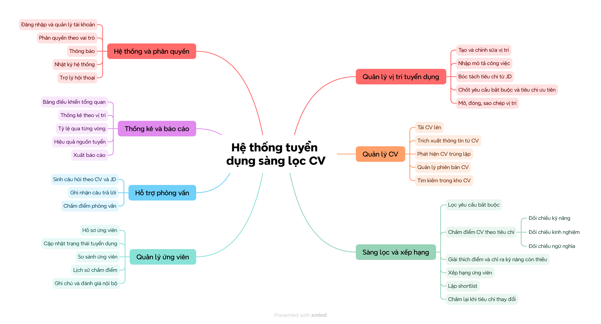

# AI Recruitment Assistant — Screening & Candidate Ranking System

An intelligent, explainable recruitment assistant designed to automate resume screening and candidate ranking based on Job Descriptions (JD). Built to eliminate human screening fatigue and unconscious bias while maintaining complete transparency through verifiable AI evidence auditing.

The system is implemented using pure **HTML5, Vanilla CSS, and ES6 JavaScript** with zero external dependencies, zero build steps, and an in-memory reactive data layer mirroring a production-grade relational database schema.

---

## 1. Project Overview & Core Workflow

In modern recruitment campaigns, talent acquisition teams often receive hundreds of CVs per opening. Traditional manual screening is slow, inconsistent, and prone to fatigue. Conversely, generic AI screening tools act as opaque "black boxes" that recruiters cannot trust.

This project delivers a **focused, high-impact business workflow** that directly proves the value of AI in recruitment:

```
Create Job & Ingest JD ➔ Extract Criteria ➔ Bulk Upload CVs ➔ Multi-Factor AI Scoring ➔ Ranked Leaderboard ➔ Audit Evidence & Shortlist
```

### Why this specific workflow?
This is the single recruitment workflow that **cannot be replaced by spreadsheets**:
- Ingesting 40+ multi-format CVs and returning the top ranked candidates with mathematical precision.
- Backing every score with verifiable citations directly linked to the candidate's original resume text.
- Allowing instant "what-if" simulations by tweaking criteria weights and recalculating rankings on the fly.

---

## 2. System Mindmap & Scope Definition

The system architecture is derived from a 7-branch recruitment mindmap, isolating the critical screening flow and its underlying dependencies while explicitly scoping out ancillary HR administrative features.

### System Mindmap Diagram


### Functional Scope Matrix

| Mindmap Module | In-Scope Features (Implemented) | Deliberately Out-of-Scope |
| :--- | :--- | :--- |
| **1. Job Management** (*Quản lý vị trí*) | Job requisition creation/editing, raw JD ingestion, automated criteria extraction, mandatory vs. preferred rule formulation, opening/closing job positions. | Job cloning / duplication. |
| **2. CV Management** (*Quản lý CV*) | Bulk multi-file upload, entity & skill extraction, duplicate CV detection (`file_hash` SHA-256), multi-version resume tracking (`version`). | CV repository semantic search across all historical campaigns. |
| **3. Screening & Ranking** (*Sàng lọc & Xếp hạng*) | **100% In-Scope**: Mandatory knockout filtering, multi-factor weighted scoring, explainable score breakdown with missing skills identification, candidate ranking, shortlisting/rejection, dynamic rescoring upon criteria updates. | Semantic embedding matching via `pgvector` (schema column reserved; simulated in current release). |
| **4. Candidate Management** (*Quản lý ứng viên*) | Full candidate profiles, application status transitions (*Scoring*, *Scored*, *Shortlisted*, *Rejected*), multi-round scoring history. | Candidate side-by-side comparison matrix, internal collaborative recruiter notes. |
| **5. Interview Support** (*Hỗ trợ phỏng vấn*) | — | Complete module (interview kit generator, scheduling, scorecards). |
| **6. Analytics & Reports** (*Thống kê & Báo cáo*) | — | Complete module (channel attribution, demographic diversity reports). |
| **7. System & Permissions** (*Hệ thống & Phân quyền*) | — | Complete module (multi-tenant RBAC, audit logs, authentication). |

---

## 3. Core System Features

The system is structured into 4 core functional pillars:

### 3.1 Job Requisition & Criteria Extraction (`jobs`, `job_requirements`)
- **Job Requisition Management**: Manages campaign status (`draft`, `open`, `closed`), seniority level, location, and tracks recruitment pipeline metrics.
- **Raw JD Ingestion**: Preserves the original unparsed Job Description (`jd_raw_text`) to allow human auditors to verify criteria extraction accuracy.
- **AI-Assisted Criteria Extraction**: Automatically parses unstructured JD text into structured requirements categorized into:
  1. **Mandatory Criteria**: Hard knockout rules (e.g., *≥ 4 years Node.js, Microservices experience, Computer Science Degree*). Failure to satisfy any mandatory criterion flags the applicant as disqualified (`passed_mandatory = false`).
  2. **Preferred Criteria**: Weighted bonus criteria (e.g., *Golang, Docker/Kubernetes, CI/CD, English fluency*).
- **Customizable Weight Sliders**: Each criterion carries an adjustable numeric weight (`weight`), strictly validated to sum to 100%.

### 3.2 CV Management & Normalized Parsing (`resumes`, `resume_skills`, `skills`)
- **Multi-Format Ingestion Pipeline**: Ingests batches of resumes across multiple states:
  - *Parsed*: Content normalized and extracted.
  - *Parsing*: Asynchronous file processing stream.
  - *Duplicate*: Detected via cryptographic SHA-256 content hashing (`file_hash`) or candidate email deduplication.
  - *Parsing Error*: Flagged for OCR or file corruption anomalies.
- **Centralized Skills Dictionary (`skills`)**: Resolves nomenclature variations (e.g., "ReactJS", "React.js", "react" map to standardized canonical skill `React`) to ensure deterministic matching.
- **Multi-Version Tracking (`resumes.version`)**: Enables a candidate to submit updated resumes across multiple job postings without overwriting previous submission records.

### 3.3 AI Screening & Ranking Engine (`screenings`, `screening_details`)
- **Two-Stage Multi-Factor Evaluation**:
  - **Stage 1 — Hard Knockout Filter**: Validates mandatory qualifications. Disqualified candidates are preserved in the system but routed below a visual demarcation line on the leaderboard.
  - **Stage 2 — Multi-Component Scoring**:
    ```text
    total_score = 0.55 * skill + 0.30 * experience + 0.15 * education
    ```
    *(Or `0.45 * skill + 0.25 * exp + 0.10 * edu + 0.20 * semantic` when semantic embeddings are active).*
- **Sub-Component Score Formulas**:
  - **Skill Score**:
    ```text
    skill_score = Σ(weight_i × match_level_i) / Σ(weight_i) × 100
    ```
    *(where `match_level` is 1.0 for Full Match, 0.5 for Partial Match, and 0.0 for Missing).*
  - **Experience Score**:
    ```text
    experience_score = min(candidates.years_experience / min_years, 1.25) × 80
    ```
  - **Education Score**: Lookup conversion mapped from `candidates.highest_degree`.
- **Explainable Audit Details (`screening_details`)**:
  - Each evaluated criterion stores its match status (`matched`, `partial`, `missing`), points contributed, and exact verbatim **evidence quotation** extracted from the CV.
- **Candidate Leaderboard**:
  - Displays candidates ranked in descending order of `total_score`.
  - In-line competency chips indicating matched and missing skills.
  - Dedicated **Knockout Demarcation Divider**: Disqualified applicants are clearly grouped beneath this line with an explicit reason banner, rather than silently deleted.
- **One-Click Candidate Actions**: Instant **Shortlist** (with ink-blue status `#1B3A63`) and **Reject** modals directly accessible from table rows.

### 3.4 Dynamic Rescoring & What-If Simulation (`scored_round`, `is_latest`)
- **Parameter Recalibration**: Recruiters can modify criteria weights or promote a preferred criterion to mandatory (e.g., toggling *Docker* to Mandatory).
- **Multi-Round Versioning**:
  - Automatically archives previous screening results (`is_latest = FALSE`).
  - Generates a new evaluation round (`scored_round = scored_round + 1, is_latest = TRUE`).
- **Comparative Diff Analysis**: Displays a side-by-side leaderboard comparison showing ranking shifts (e.g., top candidate drops from Rank 1 to Rank 20 below the divider due to a missing mandatory skill; overall passing count drops from 31 to 19).

---

## 4. How to Run (Zero Dependencies / Zero Setup)

The application is completely standalone and requires **no Node.js build steps, no package installations, and no compiler configuration**.

### Method 1: Direct File Launch (Quickest)
Simply double-click **`index.html`** in your file manager to open the prototype directly in any modern browser (Chrome, Edge, Firefox, Safari).

### Method 2: Local HTTP Server
Run using any standard local development server:

**Using Node.js:**
```bash
npx serve .
# or
npx http-server . -p 8080
```

**Using Python:**
```bash
python -m http.server 8080
```

Open your browser and navigate to: **`http://localhost:8080`**

---

## 5. Repository Structure

```
recruitment-assistant/
├── index.html                   # Single-Page Application shell with hash router & modals
├── README.md                    # System documentation, mindmap & architectural specifications
├── thiet-ke-sang-loc-cv-v2.md   # Original Vietnamese database & UI/UX design specification
├── css/
│   ├── tokens.css               # Design system variables (colors, typography, spacing)
│   └── app.css                  # Application layouts, responsive tables & animations
├── js/
│   ├── data.js                  # Relational mock database (jobs, criteria, 42 CVs, scores)
│   └── app.js                   # In-memory reactive state manager, router & screen renderers
└── docs/
    ├── mindmap.png              # 7-branch recruitment system mindmap
    └── database-design-erd.png  # 8-table relational database architecture diagram
```

---

*Academic Capstone Project — Intelligent Recruitment Screening & Explainable Candidate Ranking System.*