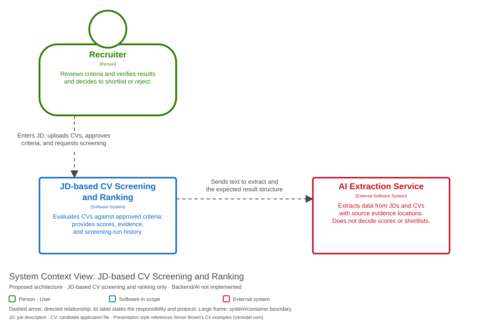
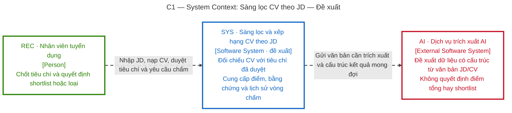

# C1 — System Context: CV Screening and Ranking against a JD

**Status:** proposed architecture; the backend and the AI integration are not implemented.

**Scope:** one screening subsystem, not the entire HR system.

**Audience:** business users, academic reviewers, and the development team.

[Open the SVG](diagrams/c1-context.svg) to zoom in or embed it in a report.

Mermaid — equivalent content and relationships

## Boundary and legend

- The `SYS` box is the boundary of the software being designed; the applications, database, and CV store inside it appear only from C2 onwards.
- The green person figure `[Person]` is a user; the blue box `[Software System]` is the system under consideration; the red box `[External Software System]` is an external system. The element-type labels remain distinguishable when printed without colour.
- A dashed arrow denotes a directed relationship. It does not denote an asynchronous call or an unimplemented state.
- The arrow points from the party that initiates the exchange; return values travel over the same connection and are therefore not drawn separately. This convention is kept in C2, C3, and the deployment view. C1 describes business exchanges and does not yet fix protocols.
- JD is the job description; CV is the candidate's application file; AI is the extraction support service. Calling an external service is a design choice; no vendor has been selected.

Candidates do not log in or submit CVs through this system: the recruiter loads CVs that have already been received. The department head and the administrator appear in the older overall use-case model but have no dedicated process within this scope. The skills dictionary is loaded from configuration data; no dictionary administration screen has been built.

The AI is not given the task of deciding hire/reject on its own. The system validates the extracted data, applies rules to compute scores, and keeps the below-threshold group in the results so the user can review it.

Next: [C2 — opening up the structure of SYS](c2-containers.md).
