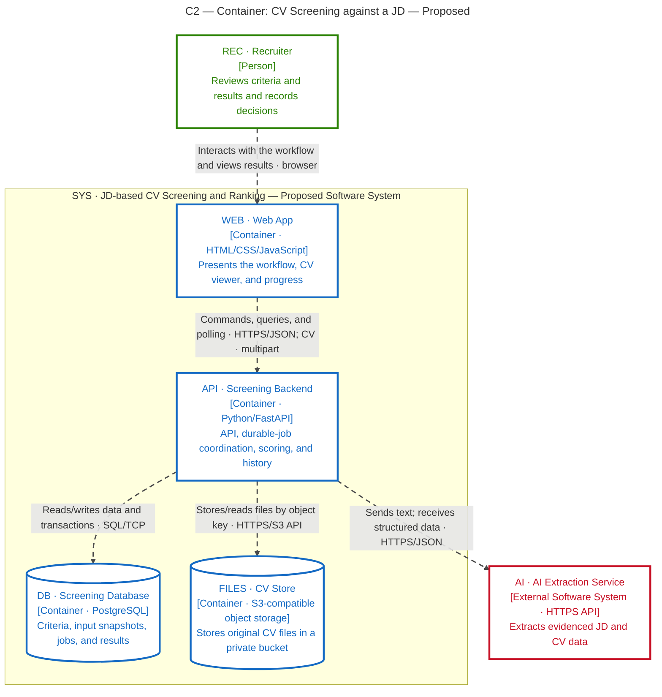

# C2 — Container: CV Screening and Ranking against a JD

**Status:** proposal for a production-intended system.

**Scope:** opens up `SYS` from C1.

**Audience:** the design, development, and operations teams.

[Open the SVG](diagrams/c2-containers.svg) to zoom in or embed it in a report.

Mermaid — equivalent content and relationships

## Responsibilities and contracts

| ID | Responsibility | Boundary |
|---|---|---|
| WEB | Rendering, position-status display/filter, data entry, action confirmation, job polling | Holds no AI key, computes no authoritative score, has no direct database access; applies Q11 data-handling rules |
| API | Creates/reads positions; validates input and position context; runs the pipeline; returns rankings; publishes new runs; serves files to the CV viewer | One modular backend; no position-status transition operation in v1 |
| DB | Position metadata and stored lifecycle status, immutable snapshots, job state, and the run-publication transaction | Defined by the 13-table DBML and database-design.md; transaction/immutability enforcement requires implementation |
| FILES | Original PDF/DOCX files, identified by object key and hash | Private bucket; in this design WEB reads through the API |
| AI | Extracts criteria, CV information, and citation positions | Output is untrusted by default; the API validates the schema and cross-checks it against the source text |

A dashed arrow marks the party that initiates the call; return values travel over the same connection and are not drawn separately. Dashed does not mean asynchronous processing. The green person figure is a user; the blue frame encloses the system's containers; the red box is an external system. The window icon is the Web App, the terminal prompt is the backend, the cylinder is the database, and the bucket shape is the file store. The accompanying type/technology labels keep the diagram readable when printed without colour. HTTP(S) is the web protocol; JSON is the data format; SQL is the database query interface; the S3 API is the object-storage interface. "Container" here is the C4 unit of application or data store, not necessarily a Docker container.

## Position lifecycle and UI data exposure

Under [US-01 AC-4](../requirements/README.md#us-01--create-position-and-jd), API creates each position with stored lifecycle status `draft`. WEB displays the stored `draft`, `open`, or `closed` status in the list and workspace and offers a list filter. API validates the filter and DB supplies the stored value. V1 exposes no lifecycle transition command or UI control. This status is distinct from screening-run state and candidate decisions and introduces no additional screening prerequisite.

Under [Q11](../requirements/non-functional-requirements.md), WEB keeps raw CV content and contact details out of URLs, analytics labels, notifications, client-side errors, and persistent browser storage (including localStorage, IndexedDB, and persistent caches). Sensitive viewing data is held only for the active view and released when leaving it. API checks the requested position context before returning run, result, or CV data, including file content. Private storage and opaque IDs alone do not enforce this relationship. See [C3 responsibilities](c3-components.md#position-lifecycle-and-q11-responsibilities) and [SEQ-02](sequence-02-review.md).

## Background processing at project scale

The API records the job in the database before returning `202 Accepted` with a `run_id`. A dispatcher running inside the same backend process picks up durable jobs from the database, limited to one active job per position. Progress is retrieved by polling the API. If the process stops, the job is reclaimed once its lease expires; result writes carry an idempotency key and a lease check to prevent duplication.

Redis, a message broker, and a separately deployed worker are not needed yet. Splitting out a worker is an expansion path once load figures exist, not a hidden component in the current diagram. Python/FastAPI is a proposal for the text pipeline; the fact that a sample CV mentions FastAPI is not evidence that the project already has such a backend.

The current prototype implements only the interface corresponding to `WEB`, using `js/data.js` and state variables in place of the connections above.

Next: [C3 — opening up the API alone](c3-components.md), [Deployment](deployment.md), [arc42](arc42.md).
