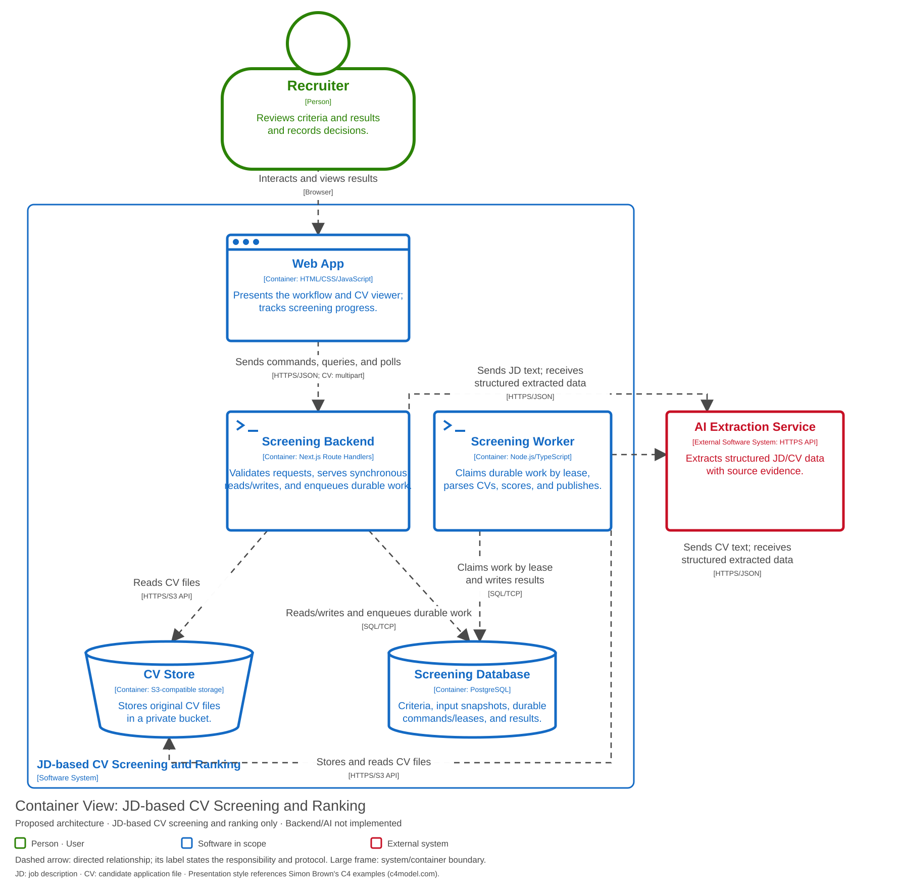

# C2 — Container: CV Screening and Ranking against a JD

**Runtime/API update (2026-09-16):** This view reflects the [Next.js backend decision](nextjs-backend.md): a separate `API` (Next.js Route Handlers) and `WORKER` (Node.js/TypeScript) process, coordinated only through a lease/command table in PostgreSQL, with no message broker. [OpenAPI](../api/openapi.yaml) defines canonical HTTP behavior; business invariants are unchanged.

**Status:** proposal for a production-intended system.

**Scope:** opens up `SYS` from C1.

**Audience:** the design, development, and operations teams.

[Open the SVG](diagrams/c2-containers.svg) to zoom in or embed it in a report.

```mermaid
---
title: "C2 — Container: CV Screening against a JD — Proposed"
---
flowchart TB
    REC["REC · Recruiter<br/>[Person]<br/>Reviews criteria and results and records decisions"]
    subgraph SYS["SYS · JD-based CV Screening and Ranking — Proposed Software System"]
        WEB["WEB · Web App<br/>[Container · HTML/CSS/JavaScript]<br/>Presents the workflow, CV viewer, and progress"]
        API["API · Screening Backend<br/>[Container · Next.js Route Handlers, Node.js]<br/>HTTP API, validation, and synchronous reads/writes"]
        WORKER["WORKER · Screening Worker<br/>[Container · Node.js/TypeScript]<br/>Durable extraction, screening execution, and publication"]
        DB[("DB · Screening Database<br/>[Container · PostgreSQL]<br/>Criteria, input snapshots, durable commands/leases, jobs, and results")]
        FILES[("FILES · CV Store<br/>[Container · S3-compatible object storage]<br/>Stores original CV files in a private bucket")]
        WEB -->|"Commands, queries, and polling · HTTPS/JSON; CV · multipart"| API
        API -->|"Reads/writes data and enqueues durable work · SQL/TCP"| DB
        API -->|"Reads files by object key · HTTPS/S3 API"| FILES
        WORKER -->|"Claims durable work by lease and writes results · SQL/TCP"| DB
        WORKER -->|"Stores/reads files by object key · HTTPS/S3 API"| FILES
    end
    AI["AI · AI Extraction Service<br/>[External Software System · HTTPS API]<br/>Extracts evidenced JD and CV data"]
    REC -->|"Interacts with the workflow and views results · browser"| WEB
    API -->|"Sends JD text; receives structured data · HTTPS/JSON"| AI
    WORKER -->|"Sends CV text; receives structured data · HTTPS/JSON"| AI
    classDef person fill:#fff,color:#2b8205,stroke:#2b8205,stroke-width:3px
    classDef internal fill:#fff,color:#146ac4,stroke:#146ac4,stroke-width:3px
    classDef external fill:#fff,color:#c71025,stroke:#c71025,stroke-width:3px
    class REC person
    class WEB,API,WORKER,DB,FILES internal
    class AI external
    linkStyle default stroke:#494949,stroke-width:2px,stroke-dasharray:8 6
```

Mermaid — equivalent content and relationships

## Responsibilities and contracts

| ID | Responsibility | Boundary |
|---|---|---|
| WEB | Rendering, position-status display/filter, data entry, action confirmation, job polling | Holds no AI key, computes no authoritative score, has no direct database access; applies Q11 data-handling rules |
| API | Creates/reads positions; validates input and position context; serves synchronous reads (ranking, evidence, decisions); enqueues durable extraction/run commands; serves files to the CV viewer | Never computes an authoritative score itself; no position-status transition operation in v1 |
| WORKER | Claims durable extraction and screening commands by lease; parses CVs, scores snapshots, and publishes runs transactionally | Separate process from API; survives request completion and resumes after restart ([Q05](../requirements/non-functional-requirements.md)); shares domain/scoring code with API, not a copy |
| DB | Position metadata and stored lifecycle status, immutable snapshots, durable command/lease records, job state, and the run-publication transaction | Defined by the 13-table DBML plus the storage gaps in [api/README.md §8](../api/README.md#8-persistence-mapping-and-implementation-prerequisites); transaction/immutability enforcement requires implementation |
| FILES | Original PDF/DOCX files, identified by object key and hash | Private bucket; in this design WEB reads through the API |
| AI | Extracts criteria, CV information, and citation positions | Output is untrusted by default; the API validates the schema and cross-checks it against the source text |

A dashed arrow marks the party that initiates the call; return values travel over the same connection and are not drawn separately. Dashed does not mean asynchronous processing. The green person figure is a user; the blue frame encloses the system's containers; the red box is an external system. The window icon is the Web App, the terminal prompt is the backend, the cylinder is the database, and the bucket shape is the file store. The accompanying type/technology labels keep the diagram readable when printed without colour. HTTP(S) is the web protocol; JSON is the data format; SQL is the database query interface; the S3 API is the object-storage interface. "Container" here is the C4 unit of application or data store, not necessarily a Docker container.

## Position lifecycle and UI data exposure

Under [US-01 AC-4](../requirements/README.md#us-01--create-position-and-jd), API creates each position with stored lifecycle status `draft`. WEB displays the stored `draft`, `open`, or `closed` status in the list and workspace and offers a list filter. API validates the filter and DB supplies the stored value. V1 exposes no lifecycle transition command or UI control. This status is distinct from screening-run state and candidate decisions and introduces no additional screening prerequisite.

Under [Q11](../requirements/non-functional-requirements.md), WEB keeps raw CV content and contact details out of URLs, analytics labels, notifications, client-side errors, and persistent browser storage (including localStorage, IndexedDB, and persistent caches). Sensitive viewing data is held only for the active view and released when leaving it. API checks the requested position context before returning run, result, or CV data, including file content. Private storage and opaque IDs alone do not enforce this relationship. See [C3 responsibilities](c3-components.md#position-lifecycle-and-q11-responsibilities) and [SEQ-02](sequence-02-review.md).

## Background processing: a separate worker, coordinated by a lease table

**Process topology, locked:** the API Route Handler process is separate from the Worker; they coordinate only through a lease/command table in PostgreSQL, and no message broker is introduced — see the [Next.js backend decision](nextjs-backend.md).

API records a durable command in the database and returns `202 Accepted` with a `run_id` without executing the work itself. WORKER independently polls the same database for durable commands, claims one with an expiring lease, and executes it (extraction, scoring, publication), limited to one active run per position. Progress is retrieved by polling API, which reads the durable state WORKER has written; API and WORKER never call each other directly. If WORKER stops, its claimed work is reclaimed once the lease expires; result writes carry an idempotency key and a lease check to prevent duplication.

No message broker (Redis, RabbitMQ, SQS, ...) is introduced: the PostgreSQL command/lease table already serving the rest of this design is the coordination mechanism. WORKER is a Node.js/TypeScript process, not a hidden or future component — it is drawn above alongside API.

The current prototype implements only the interface corresponding to `WEB`, using `js/data.js` and state variables in place of the connections above.

Next: [C3 — opening up API and WORKER](c3-components.md), [Deployment](deployment.md), [arc42](arc42.md).
