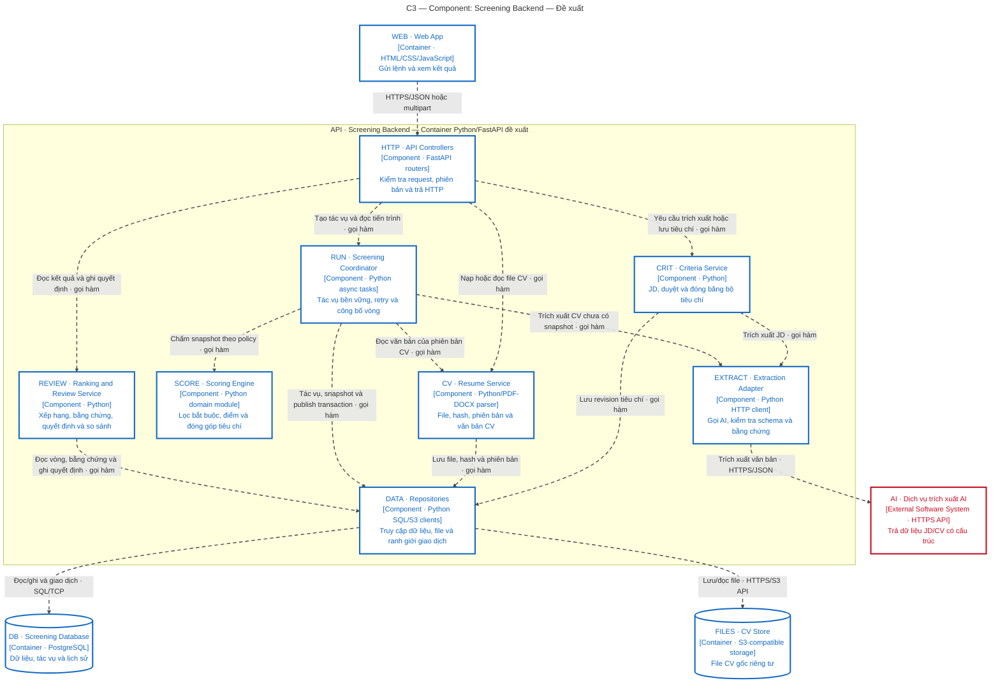

# C3 — Component: Screening Backend

**Status:** proposed; these components do not exist in the current code.

**Scope:** opens up the `API` container from C2 only.

**Audience:** backend designers and developers.

[Open the SVG](diagrams/c3-components.svg) to zoom in or embed it in a report.

Mermaid — equivalent content and relationships

## Legend and dependency rules

In the SVG, the outer frame is the `SYS` system and the inner frame is the `API` container. A box with two tabs on its left edge and a `[Component]` label is a component inside the backend. WEB, DB, and FILES sit outside the backend frame but still belong to the system; AI is a red box outside both frames. The Mermaid version omits the outer frame to keep the focus on the API; the elements and relationships are equivalent to the SVG.

A dashed arrow runs from caller to provider and states whether the call is internal or a network protocol; it does not express execution order or synchronous versus asynchronous behaviour. Element-type labels accompany the icons, so meaning does not depend on colour alone. PDF/DOCX are CV formats; the remaining abbreviations follow the [arc42 glossary](arc42.md#12-glossary).

`SCORE` only receives a snapshot and returns a result: it does not call the AI, write to the database, or read files. That makes it testable — the same input always yields the same score. `EXTRACT` returns either validated data or a structured error; it never decides a shortlist. `DATA` contains no scoring formula. `RUN` owns the job lifecycle and the run-publication transaction; `REVIEW` owns human actions.

| Component | Main contract | Failure cases |
|---|---|---|
| HTTP | Valid request → service call; response carries the ID and version | `422` for invalid data, `409` for a version or job conflict |
| CRIT | JD → draft criteria; user approval → an immutable revision | Too few criteria, weights that do not sum correctly, edits to a superseded revision |
| CV | Valid file → `resume_id`, hash, object key, status | Corrupt file, size limit exceeded, duplicate hash; never merges people on matching names alone |
| RUN | Input revision + CV list → `run_id`, progress, published run | Bounded retries, lease expiry, no CV processed successfully |
| SCORE | CV snapshot + criteria + policy → score, pass/fail, contributions | Missing data is recorded explicitly; an invalid policy is rejected |
| REVIEW | Published run → ranking/detail/diff; decisions carry an expected version | A newer run appears → the user is asked to re-check; writes never land on the wrong run |
| EXTRACT | Text + schema → data with valid spans plus metadata | Timeout, malformed JSON, evidence absent from the source |
| DATA | Repository methods plus the transaction boundary | Database rollback; compensating deletion of written files when the metadata cannot be saved |

Calls into DATA are shown at the shared repository level; no service calls the database directly. Background processing uses `RUN` inside the same API container — no worker container has been left out of the diagram.

See [the three runtime flows](arc42.md#6-runtime-view) and [the scoring rules](arc42.md#8-cross-cutting-concepts).
