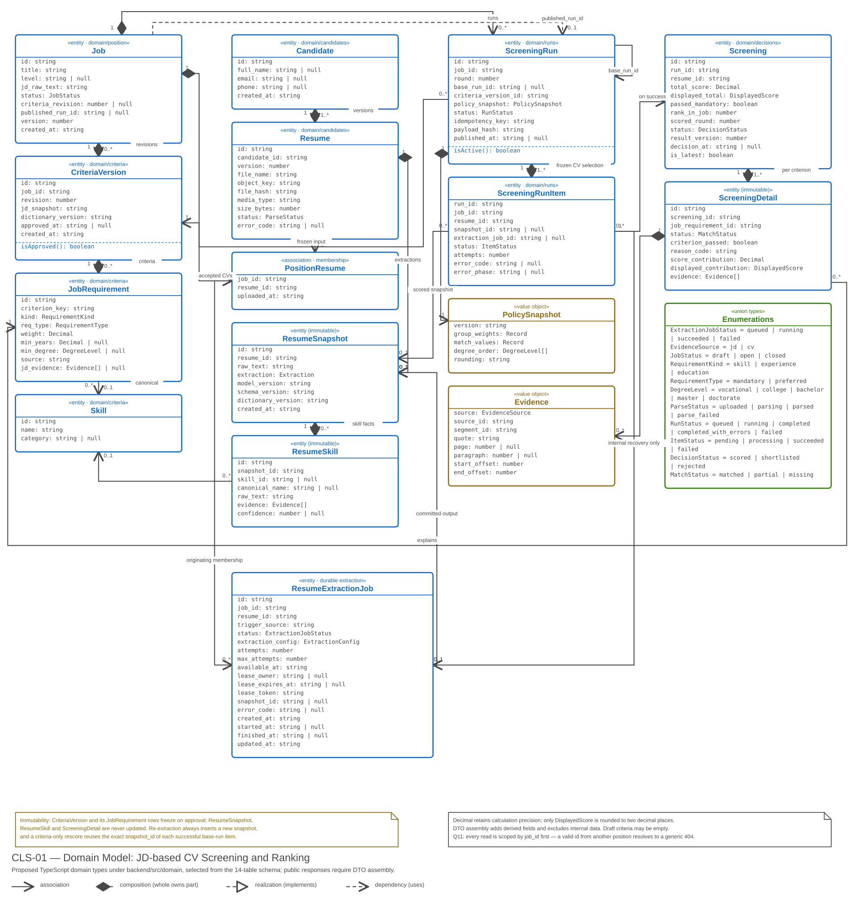

# CLS-01 — Class: domain model

**Status:** proposed; these types do not exist in the current code.

**Scope:** the TypeScript domain types under `backend/src/domain`, derived from the [13-table schema](../database-design.md) and the [OpenAPI schemas](../api/openapi.yaml). Behaviour lives in the services of [CLS-02](class-services.md); this view is the data these services operate on.

**Audience:** backend designers and developers.

This is a **selected domain view**, not a complete database schema or an API response model. Foreign-key associations and representative fields are shown; the DBML remains authoritative for every column and constraint. Domain types use `snake_case` for persisted fields, but entities must never be serialized directly as public responses.

Services assemble response DTOs against the generated `@app/api-types` contract. For example, `Job` responses add `updated_at` and computed `readiness`; `Resume` responses add position membership, `snapshot_id` and `can_screen` while excluding private `object_key`/`file_hash`; run responses add counts, mode, revision, policy version and current-state flags. Result detail, ranking and comparison also join immutable snapshots. `rank_in_job` maps to `rank`; `is_latest` remains internal. See [CLS-02](class-services.md#tier-2--backendsrcdomain).

`Decimal` is a decimal **string**, not a JavaScript float. Use decimal arithmetic with sufficient precision for the scoring formulas; do not quantize intermediate calculations to integer hundredths. Preserve calculation precision in `total_score` and `score_contribution`; `DisplayedScore` is the final two-decimal string. Allocate display remainders only at the final step under BR-SCR-04. Criteria weights have the database's two-decimal scale, which does not constrain intermediate scores.

`Nullable~T~` means a present field whose value may be `null`, not an optional property. Both diagrams use this notation. `Evidence` below is the normalized application value object: persistence adapters translate stored evidence JSON to this shape and validate source identity. `Extraction` follows [extraction-v1](../requirements/extraction-contract.md); the selected policy fields below do not replace the full frozen scoring-policy contract in the database design.

[Open the SVG](diagrams/class-domain.svg) to zoom in or embed it in a report.

```mermaid
---
title: "CLS-01 — Domain Model: JD-based CV Screening and Ranking — Proposed"
---
classDiagram
    direction LR
    class Job {
        +string id
        +string title
        +Nullable~string~ level
        +string jd_raw_text
        +JobStatus status
        +Nullable~number~ criteria_revision
        +Nullable~string~ published_run_id
        +number version
        +string created_at
    }
    class CriteriaVersion {
        +string id
        +string job_id
        +number revision
        +string jd_snapshot
        +string dictionary_version
        +Nullable~string~ approved_at
        +string created_at
        +isApproved() boolean
    }
    class JobRequirement {
        +string id
        +string criterion_key
        +RequirementKind kind
        +RequirementType req_type
        +Decimal weight
        +Nullable~Decimal~ min_years
        +Nullable~DegreeLevel~ min_degree
        +string source
        +Nullable~Evidence[]~ jd_evidence
    }
    class Skill {
        +string id
        +string name
        +Nullable~string~ category
    }
    class Candidate {
        +string id
        +Nullable~string~ full_name
        +Nullable~string~ email
        +Nullable~string~ phone
        +string created_at
    }
    class Resume {
        +string id
        +string candidate_id
        +number version
        +string file_name
        +string object_key
        +string file_hash
        +string media_type
        +number size_bytes
        +ParseStatus status
        +Nullable~string~ error_code
    }
    class PositionResume {
        +string job_id
        +string resume_id
        +string uploaded_at
    }
    class ResumeSnapshot {
        +string id
        +string resume_id
        +string raw_text
        +Extraction extraction
        +string model_version
        +string schema_version
        +string dictionary_version
        +string created_at
    }
    class ResumeSkill {
        +string id
        +string snapshot_id
        +Nullable~string~ skill_id
        +Nullable~string~ canonical_name
        +string raw_text
        +Evidence[] evidence
        +Nullable~number~ confidence
    }
    class ScreeningRun {
        +string id
        +string job_id
        +number round
        +Nullable~string~ base_run_id
        +string criteria_version_id
        +PolicySnapshot policy_snapshot
        +RunStatus status
        +string idempotency_key
        +string payload_hash
        +Nullable~string~ published_at
        +isActive() boolean
    }
    class ScreeningRunItem {
        +string run_id
        +string job_id
        +string resume_id
        +Nullable~string~ snapshot_id
        +ItemStatus status
        +number attempts
        +Nullable~string~ error_code
        +Nullable~string~ error_phase
    }
    class Screening {
        +string id
        +string run_id
        +string resume_id
        +Decimal total_score
        +DisplayedScore displayed_total
        +boolean passed_mandatory
        +number rank_in_job
        +number scored_round
        +DecisionStatus status
        +number result_version
        +Nullable~string~ decision_at
        +boolean is_latest
    }
    class ScreeningDetail {
        +string id
        +string screening_id
        +string job_requirement_id
        +MatchStatus status
        +boolean criterion_passed
        +string reason_code
        +Decimal score_contribution
        +DisplayedScore displayed_contribution
        +Evidence[] evidence
    }
    class PolicySnapshot {
        <<value object>>
        +string version
        +Record group_weights
        +Record match_values
        +DegreeLevel[] degree_order
        +string rounding
    }
    class Evidence {
        <<value object>>
        +EvidenceSource source
        +string source_id
        +string segment_id
        +string quote
        +Nullable~number~ page
        +Nullable~number~ paragraph
        +number start_offset
        +number end_offset
    }
    class Enumerations {
        <<union types>>
        +EvidenceSource jd/cv
        +JobStatus draft/open/closed
        +RequirementKind skill/experience/education
        +RequirementType mandatory/preferred
        +DegreeLevel vocational/college/bachelor/master/doctorate
        +ParseStatus uploaded/parsing/parsed/parse_failed
        +RunStatus queued/running/completed/completed_with_errors/failed
        +ItemStatus pending/processing/succeeded/failed
        +DecisionStatus scored/shortlisted/rejected
        +MatchStatus matched/partial/missing
    }
    Job "1" *-- "0..*" CriteriaVersion : revisions
    CriteriaVersion "1" *-- "0..*" JobRequirement : criteria
    JobRequirement "0..*" --> "0..1" Skill : canonical
    Candidate "1" *-- "1..*" Resume : versions
    Resume "1" --> "0..*" PositionResume
    Resume "1" *-- "0..*" ResumeSnapshot : extractions
    ResumeSnapshot "1" *-- "0..*" ResumeSkill : skill facts
    ResumeSkill "0..*" --> "0..1" Skill
    Job "1" *-- "0..*" PositionResume : accepted CVs
    Job "1" *-- "0..*" ScreeningRun : runs
    Job ..> "0..1" ScreeningRun : published_run_id
    ScreeningRun "0..*" --> "1" CriteriaVersion : frozen input
    ScreeningRun --> "0..1" ScreeningRun : base_run_id (rescore)
    ScreeningRun "1" *-- "1..*" ScreeningRunItem : frozen CV selection
    ScreeningRunItem "0..*" --> "0..1" ResumeSnapshot : scored snapshot
    ScreeningRun "1" *-- "1" PolicySnapshot
    ScreeningRunItem "1" --> "0..1" Screening : on success
    Screening "1" *-- "1..*" ScreeningDetail : per criterion
    ScreeningDetail "0..*" --> "1" JobRequirement : explains
    ScreeningDetail "1" *-- "0..*" Evidence
```



<details>
<summary>Mermaid — equivalent content and relationships</summary>



</details>

## Reading the relationships

A filled diamond marks composition: the whole owns the part, and the part belongs to that whole. This expresses ownership, not SQL cascade deletion: historical foreign keys use RESTRICT. `Job` composes its criteria revisions, its accepted CV memberships and its runs; `CriteriaVersion` composes its criteria; `Candidate` composes its CV versions; `ScreeningRun` composes its items and its frozen policy; `Screening` composes the per-criterion breakdown. A plain arrow marks a reference that survives independently — `JobRequirement` points at a canonical `Skill` that exists on its own, and `ScreeningRunItem` points at the `ResumeSnapshot` it scored.

Two arrows leave `Job` for `ScreeningRun`. The composition is ownership of every run in the position; the dashed dependency is the single `published_run_id` pointer that ranking reads. Switching that pointer is what publication means, and it is the only way a new run becomes visible — see [BR-RUN and BR-RSC](../requirements/business-rules.md).

`ScreeningRun` refers to itself through `base_run_id`. That self-reference is what makes a criteria-only rescore possible: the new run reuses precisely the successful `(resume_id, snapshot_id)` pairs of the source run, so no CV is read or extracted a second time.

## Invariants this view encodes

| Invariant | Where it shows | Rule |
|---|---|---|
| Approved criteria are frozen | `CriteriaVersion.approved_at`, composition of `JobRequirement` | A draft may contain zero criteria; approval requires at least one. Approval freezes the revision and its criteria; a later approval creates revision N+1 rather than editing N |
| Extraction is append-only | `Resume` composes `0..* ResumeSnapshot` | Re-extraction inserts another snapshot; an existing snapshot is never modified |
| Run inputs are frozen | `ScreeningRun` composes `PolicySnapshot` and `1..* ScreeningRunItem` | Policy and CV selection are captured at creation, so a historical run stays reproducible |
| A failure is not a zero score | `ScreeningRunItem.status`, `error_code`; `Screening` only `on success` | A failed item has an error code and no result row; it never appears as a candidate who scored badly |
| Evidence points into a real source | `Evidence.source`, `source_id`, `segment_id`, offsets | CV evidence resolves into the selected resume snapshot; JD evidence resolves into the captured job version (draft) or approved criteria version |
| Decisions are final | `Screening.status`, `result_version`, `decision_at` | A decision is applied once against an expected version; a stale or contradictory request conflicts |

`semantic_score` exists in the database but is always `NULL` in v1, so it is omitted here rather than modelled as a field that no code writes.

For evidence, offsets are Unicode code-point offsets `[start,end)`, with an exact quote match. `source=cv` identifies `resume_snapshots.id`; `source=jd` identifies the captured job version within job context before approval, then the immutable criteria-version row after approval. Missing page/paragraph values are explicit `null`. A JD source must not be interpreted as a CV snapshot.

## Q11 — position scoping

Every read path in this model starts from `job_id`, not from the resource id alone. `PositionResume` is the membership gate for CVs, and the composite relationships from `Job` through `ScreeningRun` to `Screening` are what allow a lookup to be scoped before any content is returned. A structurally valid id belonging to another position resolves to a generic `404` with no content or metadata from that position — see [Q11](../requirements/non-functional-requirements.md) and [C3](c3-components.md#position-lifecycle-and-q11-responsibilities).

## Rendering

The SVG is generated by [render-class.cjs](render-class.cjs), which emits plain SVG and requires no dependencies:

```bash
node docs/architecture/render-class.cjs
```

The script reads class members from Mermaid, verifies class identities, relationship kinds and multiplicities, and rejects overlapping or out-of-canvas boxes. Change members in this Markdown source; adjust the script layout when adding classes or relationships, then regenerate both SVGs.

Related: [CLS-02 — services and ports](class-services.md), [C3 — components](c3-components.md), [database design](../database-design.md).
