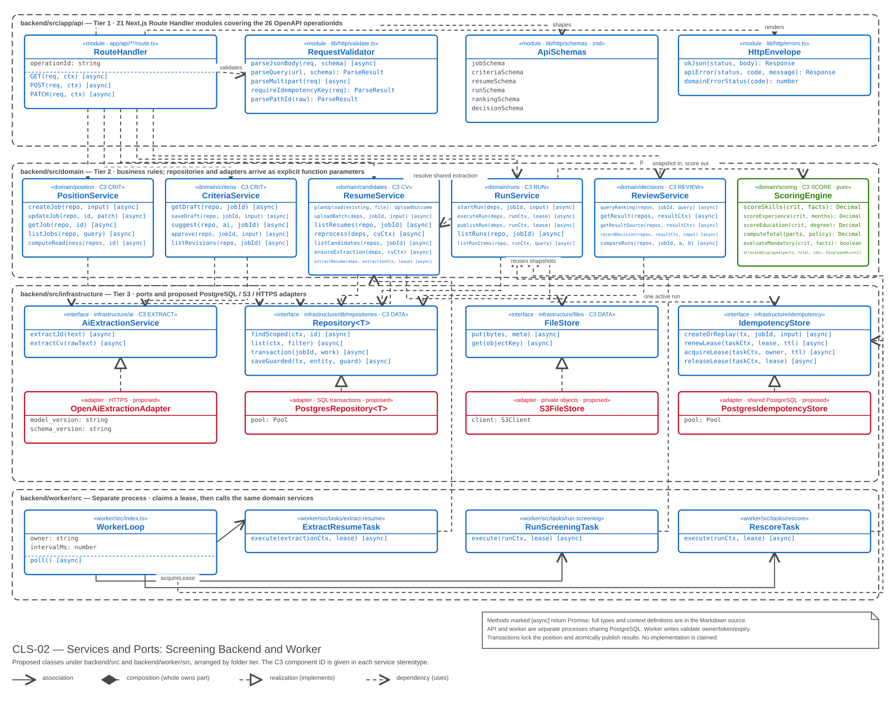

# CLS-02 — Class: services and ports

**Status:** proposed; these classes do not exist in the current code. The route files exist but every handler still returns `501 not_implemented`.

**Scope:** the TypeScript modules under `backend/src` and `backend/worker/src`, arranged by folder tier so the diagram and the directory tree read the same way. The data these services operate on is [CLS-01](class-domain.md).

**Audience:** backend developers implementing the handlers, services and adapters.

The main call path is `app/api` → `domain` → infrastructure ports. Adapters implement those ports; the separate worker also calls domain services. These are code dependencies, not cross-process calls. No domain module imports a Next.js type, and no adapter class name appears in a service signature.

[Open the SVG](diagrams/class-services.svg) to zoom in or embed it in a report.

```mermaid
---
title: "CLS-02 — Services and Ports: Screening Backend and Worker — Proposed"
---
classDiagram
    direction TB
    class RouteHandler {
        <<module · app/api/**/route.ts>>
        +string operationId
        +GET(req, ctx) Promise~Response~
        +POST(req, ctx) Promise~Response~
        +PATCH(req, ctx) Promise~Response~
    }
    class RequestValidator {
        <<module · lib/http/validate.ts>>
        +parseJsonBody(req, schema) Promise~ParseResult~
        +parseQuery(url, schema) ParseResult
        +parseMultipart(req) Promise~ParseResult~
        +requireIdempotencyKey(req) ParseResult
        +parsePathId(raw) ParseResult
    }
    class ApiSchemas {
        <<module · lib/http/schemas · zod>>
        +jobSchema
        +criteriaSchema
        +resumeSchema
        +runSchema
        +rankingSchema
        +decisionSchema
    }
    class HttpEnvelope {
        <<module · lib/http/errors.ts>>
        +okJson(status, body) Response
        +apiError(status, code, message) Response
        +domainErrorStatus(code) number
    }
    class PositionService {
        <<domain/position · C3 CRIT>>
        +createJob(repo, input) Promise~JobDto~
        +updateJob(repo, id, patch) Promise~JobDto~
        +getJob(repo, id) Promise~JobDto~
        +listJobs(repo, query) Promise~Page~
        +computeReadiness(repos, id) Promise~Readiness~
    }
    class CriteriaService {
        <<domain/criteria · C3 CRIT>>
        +getDraft(repo, jobId) Promise~CriteriaDraft~
        +saveDraft(repo, jobId, input) Promise~CriteriaDraft~
        +suggest(repo, ai, jobId) Promise~Suggestion[]~
        +approve(repo, jobId, input) Promise~CriteriaRevision~
        +listRevisions(repo, jobId) Promise~CriteriaRevision[]~
    }
    class ResumeService {
        <<domain/candidates · C3 CV>>
        +planUpload(existing, file) UploadOutcome
        +uploadBatch(deps, jobId, input) Promise~BatchResult~
        +listResumes(repo, jobId) Promise~Page~
        +reprocess(deps, cvCtx) Promise~ResumeDto~
        +listCandidates(repos, jobId) Promise~Page~
        +ensureExtraction(deps, cvCtx) Promise~ExtractionState~
        +extractResume(deps, extractionCtx, lease) Promise~void~
    }
    class RunService {
        <<domain/runs · C3 RUN>>
        +startRun(deps, jobId, input) Promise~RunDto~
        +executeRun(deps, runCtx, lease) Promise~void~
        +publishRun(deps, runCtx, lease) Promise~RunDto~
        +listRuns(repo, jobId) Promise~Page~
        +listRunItems(repo, runCtx, query) Promise~Page~
    }
    class ReviewService {
        <<domain/decisions · C3 REVIEW>>
        +queryRanking(repos, jobId, query) Promise~Ranking~
        +getResult(repos, resultCtx) Promise~ResultDetail~
        +getResultSource(repos, resultCtx) Promise~SourcePreview~
        +recordDecision(repos, resultCtx, input) Promise~Decision~
        +compareRuns(repos, jobId, a, b) Promise~Comparison~
    }
    class ScoringEngine {
        <<domain/scoring · C3 SCORE · pure>>
        +scoreSkills(crit, facts) Decimal
        +scoreExperience(crit, months) Decimal
        +scoreEducation(crit, degree) Decimal
        +computeTotal(parts, policy) Decimal
        +evaluateMandatory(crit, facts) boolean
        +allocateDisplayed(parts, total, ids) DisplayedScore[]
    }
    class AiExtractionService {
        <<interface · infrastructure/ai · C3 EXTRACT>>
        +extractJd(text) Promise~Suggestion[]~
        +extractCv(rawText) Promise~Extraction~
    }
    class Repository~T~ {
        <<interface · infrastructure/db/repositories · C3 DATA>>
        +findScoped(ctx, id) Promise~Nullable~T~~
        +list(ctx, filter) Promise~T[]~
        +transaction(jobId, work) Promise~Outcome~
        +saveGuarded(tx, entity, guard) Promise~T~
    }
    class FileStore {
        <<interface · infrastructure/files · C3 DATA>>
        +put(bytes, meta) Promise~StoredFile~
        +get(objectKey) Promise~StoredFile~
    }
    class IdempotencyStore {
        <<interface · infrastructure/idempotency>>
        +createOrReplay(tx, jobId, input) Promise~Outcome~
        +renewLease(taskCtx, lease, ttl) Promise~Lease~
        +acquireLease(taskCtx, owner, ttl) Promise~Lease~
        +releaseLease(taskCtx, lease) Promise~void~
    }
    class OpenAiExtractionAdapter {
        <<adapter · HTTPS · proposed>>
        +string model_version
        +string schema_version
    }
    class PostgresRepository~T~ {
        <<adapter · SQL transactions · proposed>>
        +Pool pool
    }
    class S3FileStore {
        <<adapter · private objects · proposed>>
        +S3Client client
    }
    class PostgresIdempotencyStore {
        <<adapter · shared PostgreSQL · proposed>>
        +Pool pool
    }
    class WorkerLoop {
        <<worker/src/index.ts>>
        +string owner
        +number intervalMs
        +poll() Promise~void~
    }
    class ExtractResumeTask {
        <<worker/src/tasks/extract-resume>>
        +execute(extractionCtx, lease) Promise~void~
    }
    class RunScreeningTask {
        <<worker/src/tasks/run-screening>>
        +execute(runCtx, lease) Promise~void~
    }
    class RescoreTask {
        <<worker/src/tasks/rescore>>
        +execute(runCtx, lease) Promise~void~
    }
    RouteHandler ..> RequestValidator : validates
    RouteHandler ..> ApiSchemas : shapes
    RouteHandler ..> HttpEnvelope : renders
    RouteHandler ..> PositionService
    RouteHandler ..> CriteriaService
    RouteHandler ..> ResumeService
    RouteHandler ..> RunService
    RouteHandler ..> ReviewService : position-scoped
    PositionService ..> Repository
    CriteriaService ..> Repository
    ResumeService ..> Repository
    RunService ..> Repository
    ReviewService ..> Repository
    CriteriaService ..> AiExtractionService : suggests only
    ResumeService ..> AiExtractionService
    ResumeService ..> FileStore
    RunService ..> IdempotencyStore : one active run
    RunService ..> ResumeService : resolve shared extraction
    RunService ..> ScoringEngine : snapshot in, score out
    OpenAiExtractionAdapter ..|> AiExtractionService
    PostgresRepository ..|> Repository
    S3FileStore ..|> FileStore
    PostgresIdempotencyStore ..|> IdempotencyStore
    WorkerLoop --> ExtractResumeTask
    WorkerLoop --> RunScreeningTask
    WorkerLoop --> RescoreTask
    WorkerLoop ..> IdempotencyStore : acquireLease
    ExtractResumeTask ..> ResumeService
    RunScreeningTask ..> RunService
    RescoreTask ..> RunService : reuses snapshots
```



<details>
<summary>Mermaid — equivalent content and relationships</summary>



</details>

## Tier 1 — `backend/src/app/api`

The 21 `route.ts` files cover the 26 `operationId` values in [openapi.yaml](../api/openapi.yaml). Every handler follows the same four steps and contains no business logic of its own:

1. `parsePathId` on the route parameters, so a malformed id fails before anything is read.
2. `parseJsonBody` / `parseQuery` / `parseMultipart` against the resource's zod schema; a failure returns `422 validation_failed` with `details[]`.
3. Call one domain function, passing the repositories and adapters as arguments.
4. Serialize the service-assembled DTO against the generated OpenAPI type with `okJson`, or map a domain error through `domainErrorStatus`. Never pass a persistence entity directly to the response.

`domainErrorStatus` is the single place where a business outcome becomes an HTTP status: `stale_job` / `stale_draft` / `stale_result` / `decision_final` / `active_run` / `idempotency_mismatch` → `409`, `not_found` → `404`, `invalid_*` → `422`. Keeping that table in one module is what stops the same conflict from being reported as `409` on one route and `422` on another.

`RequestValidator` and `ApiSchemas` are separate on purpose: the parsing mechanics are generic and stable, while the schemas change every time the contract changes, and they are the only tier-1 code that has to be re-checked against `openapi.yaml`.

## Tier 2 — `backend/src/domain`

Services are **modules of exported functions**. Repositories and adapters arrive as ordinary function parameters, so a unit test constructs a fresh repository per case and calls the function directly — no container, no mocking framework, no HTTP.

`ScoringEngine` is drawn apart from the other five because it performs no I/O at all: it takes an approved criteria set and an extraction snapshot, and returns numbers. That purity is what makes the scoring rules of [BR-SCR](../requirements/business-rules.md) directly testable, and it is the structural expression of the rule that **the AI never assigns a score** — `ExtractResumeTask` calls `ResumeService.extractResume` to obtain validated facts through the AI port; `RunService` only resolves snapshots through `ResumeService` and passes them to `ScoringEngine`. The scoring path never calls AI directly.

`ReviewService` is marked *position-scoped*: `CvContext = { jobId, resumeId }`, `RunContext = { jobId, runId }`, and `ResultContext = { jobId, runId, resultId }`. `ExtractionContext = { extractionJobId, jobId, resumeId }` identifies the claimed durable extraction row. Parameters named `cvCtx`, `runCtx`, `resultCtx` and `extractionCtx` carry these complete contexts. `deps` bundles the required ports, not concrete adapters. Services verify every association before returning content; a context mismatch returns generic `404`. Run comparisons explicitly receive `jobId` and validate both runs within it. Worker contexts come from durable work records. See [Q11](class-domain.md#q11--position-scoping).

All I/O operations return `Promise`; `planUpload` and `ScoringEngine` remain synchronous and pure. `JobDto`, `ResumeDto`, `RunDto`, `ResultDetail`, ranking, source and comparison outputs use the corresponding generated OpenAPI schemas. Services assemble these read models from scoped repositories, including derived flags/counts and immutable evidence, then handlers serialize them. `Page`, `Outcome`, `Lease` and the input/context names are schematic port contracts, not additional public schemas. The operation list is representative, not a replacement for all 26 OpenAPI operations (including file delivery and individual revision/run reads).

`reprocess` only commits durable extraction work and returns the accepted resume DTO. `ExtractResumeTask` calls `extractResume` under the extraction job lease; `ensureExtraction` is shared by upload/reprocess and internal initial-run recovery. Public screening still requires parsed snapshots. Recovery waits on a pinned extraction job without occupying a worker slot and never invokes AI directly. A criteria-only rescore never calls AI and retains exactly the base run's successful snapshot pairs and policy.

## Tier 3 — `backend/src/infrastructure`

The four interfaces are proposed **ports**, with production adapters matching C2/C3 and the locked Next.js runtime decision. None of these adapters is implemented yet. In-memory repositories and mock AI may be used as test doubles; they do not change the two-process runtime or satisfy durable execution.

| Port | Target adapter | Responsibility |
|---|---|---|
| `Repository<T>` | `PostgresRepository<T>` | Scoped reads and transaction-bound writes across the 14-table model |
| `AiExtractionService` | `OpenAiExtractionAdapter` | Server-only HTTPS extraction, schema/source validation and bounded retries |
| `FileStore` | `S3FileStore` | Private original files; only resolve keys after membership checks |
| `IdempotencyStore` | `PostgresIdempotencyStore` | Atomic run replay/creation and durable lease acquisition, renewal and release |

`Repository<T>` is shorthand for the repository family, not a promise that generic CRUD is sufficient. `transaction(jobId, work)` is the position-scoped transaction; extraction repository operations additionally provide resume-scoped transactions in the lock order documented in the extraction decision. Position mutations lock the position and supply one shared transaction handle to all participating repositories and the idempotency port. `saveGuarded(tx, entity, guard)` stands for domain-specific conditional writes: approval checks the expected revision; decisions check the published pointer, expected result version and final-decision rules; worker writes check owner, token and unexpired lease inside the same transaction. Immutable inputs/snapshots cannot be overwritten through this port.

Run creation uses `createOrReplay` within that transaction: bind `(job_id, idempotency_key)` to the normalized payload hash and atomically insert the run and its selected items; enforce the partial unique index for one active run. The current schema stores these fields and run leases on `screening_runs`; it has **no separate `idempotency_keys` table**. Extraction rows, retries, frozen config and leases are now defined in `resume_extraction_jobs`. See [the accepted extraction-job decision](extraction-jobs.md) for resume-level locking, global active-job deduplication and atomic completion. The generic API command/outcome replay store remains an explicit separate gap; this job table does not replace it.

Publication is a single transaction: verify terminal items, the lease and expected base pointer, require all source items for rescore (or at least one success for an initial run), finalize ranks/status, update latest flags and switch `published_run_id` together. Decision writes take the same position lock. Failed transactions leave the previous ranking and decisions intact. Adapters must support these semantics; replacing storage cannot be reduced to implementing three CRUD methods.

## Worker — `backend/worker/src`

The API and worker are **separate OS processes**, coordinated through durable PostgreSQL work/lease records. API handlers acknowledge accepted work only after commit. `WorkerLoop` polls durable work, acquires or reclaims a lease and passes its context/token to a task. Tasks invoke the shared domain modules through the `@app/backend` exports map, never by relative imports across workspaces or direct calls into the API process.

A `Lease` includes owner, monotonically increasing token and expiry. Long-running work renews it; acquisition/reclaim increments the token. Every item/result write and publication validates owner/token/expiry transactionally. An expired worker may still be executing, but its stale token cannot commit writes; acquiring a lease alone does not guarantee that old computation has stopped. Release is conditional on the current owner/token.

`taskCtx` discriminates run versus extraction work, so lease methods access `screening_runs` or `resume_extraction_jobs` without confusing their IDs. `WorkerLoop` schedules both queues fairly. `ExtractResumeTask` calls `ResumeService.extractResume`; run tasks call `RunService.executeRun` with frozen inputs. `RescoreTask` reuses source snapshots and never extracts again. These are proposed contracts: the present worker tasks and lease functions remain placeholders, and no implemented behavior or passing unit tests are claimed here.

## Rendering

The SVG is generated by [render-class.cjs](render-class.cjs), which emits plain SVG and requires no dependencies:

```bash
node docs/architecture/render-class.cjs
```

The script reads class members from Mermaid, verifies class identities, relationship kinds and multiplicities, and rejects overlapping or out-of-canvas boxes. Change members in this Markdown source; adjust the script layout when adding classes or relationships, then regenerate both SVGs.

Related: [CLS-01 — domain model](class-domain.md), [C3 — components](c3-components.md), [Next.js backend decision](nextjs-backend.md), [OpenAPI contract](../api/README.md).
