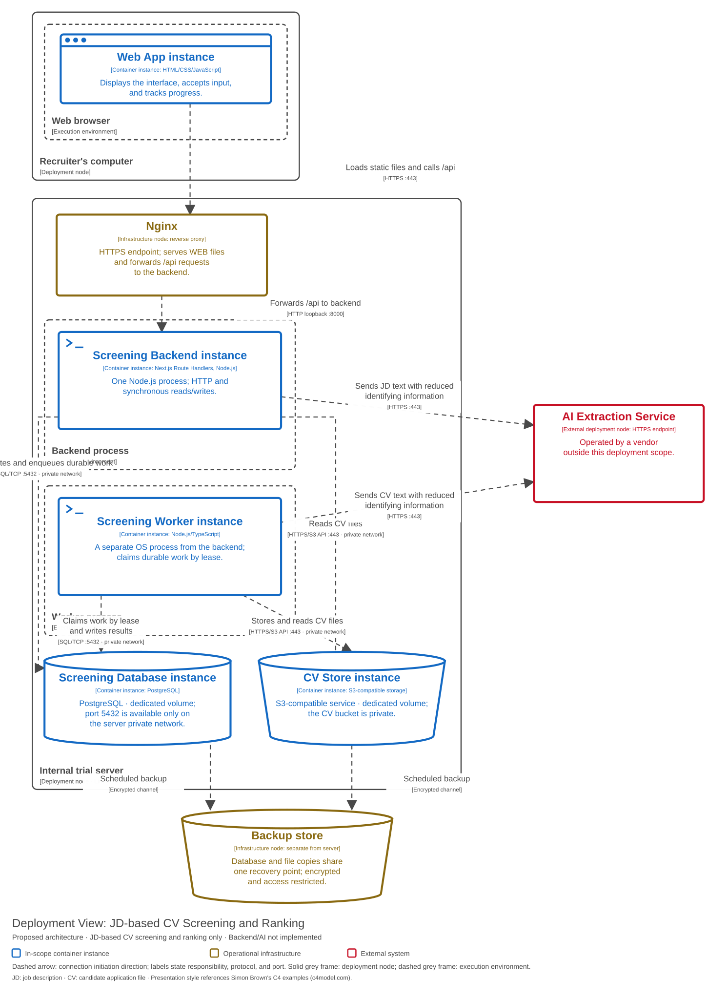
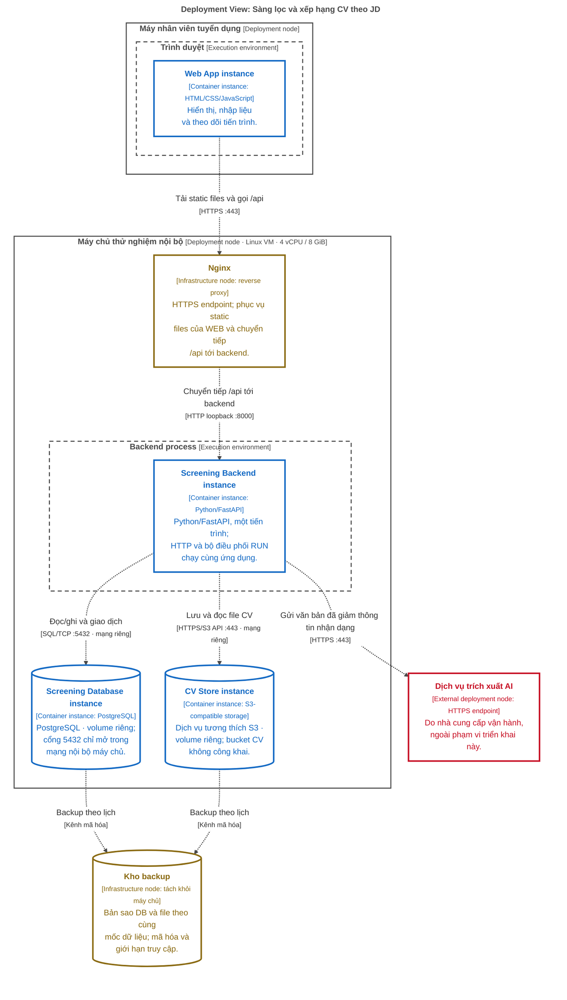

# Deployment — Internal trial environment

**Status:** a proposed deployment diagram, not infrastructure that has been built. **Scope:** one instance of the screening subsystem running on synthetic data; not a production operating configuration.

[Open the SVG](diagrams/deployment.svg) to zoom in or embed it in a report.

## Legend and mapping back to C2

A solid grey frame is a device or server (deployment node); a dashed grey frame is an execution environment; an `instance` box is a running copy of a C2 container. An Infrastructure box is supporting deployment infrastructure, not a business component. A cylinder is durable data. Blue marks components inside the scope, amber marks operational infrastructure, and red marks what lies outside the system — the same colour convention, white fill, and coloured outlines used in C1–C3. A dashed arrow shows the direction in which a connection is opened or a copy is transferred; the line in square brackets gives the protocol and port. HTTPS is HTTP over TLS; VM is a virtual machine; the vCPU/GiB figures describe a starting allocation, not the result of load measurement.

| C2 container | Where it executes or is stored |
|---|---|
| WEB | Files served by Nginx; the JavaScript executes in the browser |
| API | A single backend process; the C3 components run inside it |
| DB | PostgreSQL on the trial server; data outlives the process |
| FILES | An S3-compatible object storage service on the server; durable data |
| AI | An external vendor endpoint; no vendor has been selected |

## Intended configuration and operations

- Only the Nginx HTTPS endpoint accepts traffic from the trial network. The database, the file store, and the backend port are not exposed directly to the browser. The prototype has no login mechanism; this environment relies on network restriction and synthetic data only.
- Backend configuration covers the database connection string, the file store endpoint and bucket, access keys, the AI endpoint and model, timeouts, and batch limits. Secrets stay server-side, never in JavaScript or in the repository. No real secret values appear in this documentation.
- Static files and the API share one origin to keep connectivity simple. The API serves CV files to the browser for a valid `resume_id`; it does not expose object keys as public URLs.
- Each deployment: back up → apply tested migrations → start the backend → check the database, file store, and readiness → serve the interface. There are currently no migrations, no Docker Compose file, and no deployment pipeline; the diagram does not claim those artifacts exist.
- Health checks distinguish "the process is alive" from "ready to serve". An AI failure causes controlled job retries or failures; it does not make previously published results unavailable for reading.
- Daily database and file backups are stored away from the server, with a manifest linking `resume_id`, object key, and hash. Trial targets: RPO at most 24 hours, RTO at most 4 hours; both can be confirmed only by rehearsing a restore.
- After a restart, the dispatcher reclaims jobs whose lease has expired. Results are written only with a still-valid lease token; the currently published run is kept intact until the transaction publishing the new run completes.

A single server is a single point of failure. No high availability or automatic failover is claimed. Before real CVs are used, access control and a data-handling policy must be added; building an account administration module remains outside the scope of this business design.

## How it runs today

The current prototype is opened directly as `index.html`, or served by a static HTTP server as described in the [README](../../README.md). It does not use Nginx, FastAPI, PostgreSQL, S3, or the AI service shown in the proposal above. None of this infrastructure is needed to run the existing demo.

Related: [C2 — the containers being deployed](c2-containers.md), [operations and quality goals in arc42](arc42.md#9-architecture-decisions).
