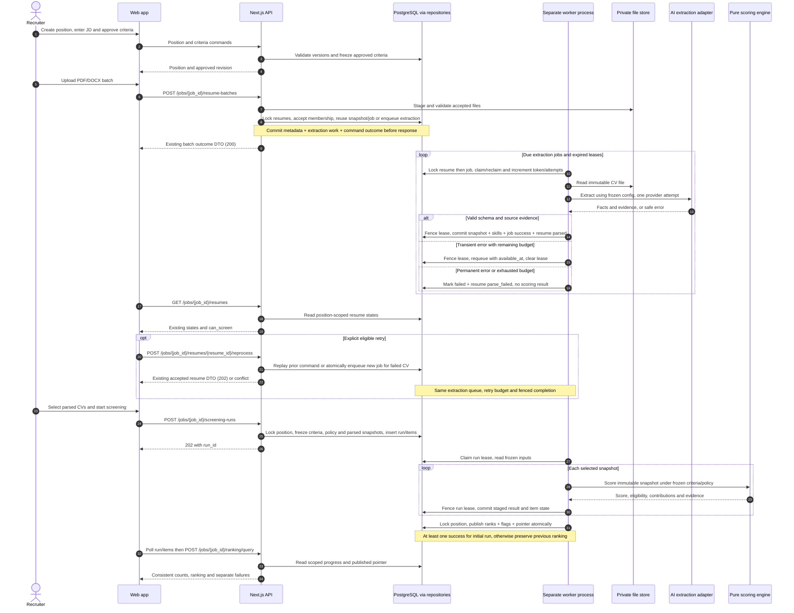

# SEQ-01 - JD setup, durable extraction and initial screening

**Updated 2026-09-17. Proposed behavior, not implemented.** API and worker are separate processes. PostgreSQL stores extraction jobs and screening runs; the shared domain/repository code is called inside each process, never across their boundary. Public API paths and responses remain governed by [OpenAPI](../api/openapi.yaml).

[Open the SVG](diagrams/sequence-01-screening.svg)

## Rules and exceptions

- [Extraction-job decision](extraction-jobs.md) defines one active job per immutable resume globally, lease renewal/fencing, three total attempts and atomic completion. Duplicate uploads do not reset failed jobs. Reprocess applies only to a parse-failed CV without a validated snapshot; command replay precedes current-state checks.
- The API never starts unawaited parsing work. Worker polling and browser polling can proceed concurrently; neither depends on the original request staying open. A failed metadata transaction compensates/cleans up only newly staged files.
- The public v1 start-run command still accepts parsed CVs only. The defensive internal recovery path for an unassigned initial item resolves the shared extraction job, pins its ID, then yields its run lease while waiting. It never calls AI directly or blocks the only worker slot. A bound extraction failure fails the item; a later reprocess cannot silently change its inputs.
- No extraction job publishes rankings or writes screening results. A technical extraction/scoring failure is separate from missing evidence and mandatory eligibility; it never creates a zero-score candidate or automatic rejection. Initial runs may publish successes with separate errors; no success means no publication.
- Same run key/payload replays the logical run; different payload conflicts. Rescore uses the exact successful base-run snapshots and policy with no extraction jobs, and publishes only when all required items succeed.
- New positions start draft; lifecycle remains display/filter only. Q11 checks position membership before lookup and before returning files/evidence. Cross-position shared-job origin stays internal. Sensitive responses use no-store; raw CV/contact data stays out of URLs, logs, notifications and persistent browser storage.
- Corrupt/textless documents require corrected uploads; OCR is outside scope. Missing information in a readable CV remains insufficient evidence, not proof of absent ability.

Related: [C3](c3-components.md), [database design](../database-design.md), [review](sequence-02-review.md), [rescore](sequence-03-rescore.md).
