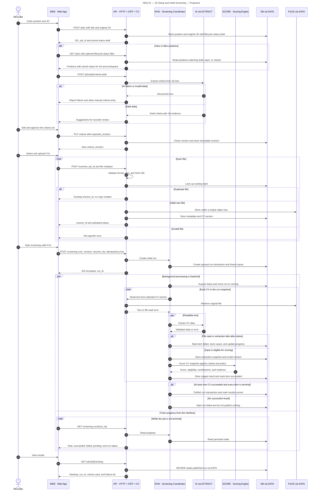

# SEQ-01 — JD setup and the first screening run

**Status:** proposed backend behaviour. **Preconditions:** the user has a JD and the CVs; the position has no active job. **Outcome:** one published run, holding results and evidence for the CVs that succeeded plus a separate list of failed CVs.

[Open the SVG](diagrams/sequence-01-screening.svg) to zoom in or embed it in a report.

## Rules and exceptions

- [US-01 AC-4](../requirements/README.md#us-01--create-position-and-jd): CRIT owns position creation and status reads through DATA. New positions start as `draft`; stored `draft`/`open`/`closed` status is displayed and filterable, with no transition control or API command in v1. Lifecycle status does not gate screening.
- [Q11](../requirements/non-functional-requirements.md): uploads and run reads carry the position context. The API checks each selected CV/run belongs to that position before accepting or returning data. WEB keeps raw CV/contact data out of URLs, telemetry labels, notifications, errors, and persistent storage. Failure messages contain safe codes/IDs, not file contents or contact details. Sensitive responses are not cached.

- The `API` lane collapses the `HTTP`, `CRIT`, and `CV` components into their container; `RUN` and `SCORE` are kept separate because the flow turns on their interaction. Participants annotated `via DATA` or `via EXTRACT` collapse the C3 adapter calls to keep the diagram readable; no service bypasses the repository on its own. RUN is a module inside the API, not a separate process or service. A solid line is a request, a dashed line a response; `alt` is a conditional branch and `loop` an iteration.
- The `par` block shows background processing and polling happening concurrently. WEB does not have to wait for scoring to finish before asking for progress; once the run ends, the interface can fetch the results or display the error.
- A missing, invalid, or superseded criteria set returns `422`/`409` and no job is created. Resending the same idempotency key with the same payload returns the same run; a different payload returns `409`.
- A PDF with no text layer is flagged as needing reprocessing; automatic OCR is not part of this first proposal. A failed file is never counted as a candidate who did not meet the criteria.
- If the file is stored successfully but the metadata write fails, the API deletes the object just created or records it for orphan cleanup; it never touches files belonging to another CV record. A unique constraint handles concurrent duplicate uploads.
- A run may end as `completed_with_errors`; the ranking contains only successful items and always states the number of failed CVs. If every CV fails, no empty ranking table is published as though scoring had completed.
- Information missing from a readable CV is recorded as insufficient evidence, which is distinct from a technical failure to read the file. The scoring rules are in [arc42 §8](arc42.md#8-cross-cutting-concepts).

Related: [C3](c3-components.md), [SEQ-02](sequence-02-review.md).
