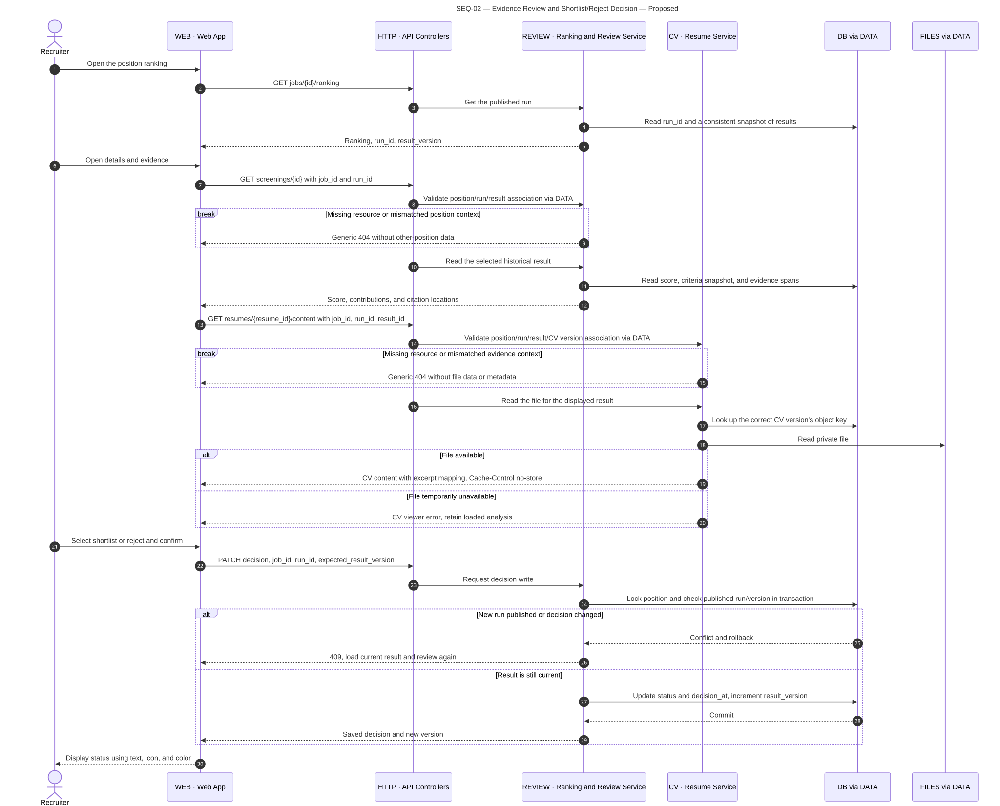

# SEQ-02 — Reviewing evidence and deciding shortlist/reject

**Runtime/API update (2026-09-16):** Technology/process labels and illustrative endpoints in this view and its SVG predate the [Next.js backend decision](nextjs-backend.md). That decision and [OpenAPI](../api/openapi.yaml) supersede those details; business invariants remain applicable.

**Status:** proposed behaviour. **Preconditions:** a published run exists. **Outcome:** the user can verify the scores; a decision is written only against the exact result being viewed, and only while it is not stale.

[Open the SVG](diagrams/sequence-02-review.svg) to zoom in or embed it in a report.

## Rules and exceptions

Under [D-05](../requirements/decisions.md#d-05--final-human-decisions-in-v1), the write branch requires status=scored. An identical decision with the current version is a no-op; a different decision on an already-decided result returns 409/decision_final. There is no undo. Check this after position/run/version validation and before updating status or decision_at.

[Q11](../requirements/non-functional-requirements.md) applies to ranking, historical detail, evidence, and decision requests. Position-context validation happens before returning data or applying changes. A context mismatch returns a generic `404`; a valid context with a stale decision returns `409`. Valid historical results remain readable within their position. These checks enforce resource relationships and do not introduce a new login or role workflow.

WEB puts only identifiers and non-sensitive navigation/filter values in URLs. Raw CV content and contact details must not enter analytics labels, notifications, client-side error messages, or persistent browser storage. Sensitive API responses use `Cache-Control: no-store`. Viewer data stays in memory and is released on close or position change, including any temporary object URL. Verify with marked synthetic data and cross-position requests, as described in [C3](c3-components.md#position-lifecycle-and-q11-responsibilities).

A solid line is a request and a dashed line a response; responses reaching WEB are drawn collapsed through HTTP. DB and FILES are reached only through DATA. A ranking read must pin a single `run_id` within one query or transaction, so that figures from two runs are never combined if a publication happens concurrently.

The AI is not called when existing results are viewed. Evidence always references the CV version and the criteria snapshot of the run being viewed. The API never accepts an arbitrary URL or file path from the browser in order to read a file.

A candidate who fails a mandatory criterion can still be viewed and shortlisted. If the user shortlists someone who did not pass, the interface states plainly which criteria were not met and asks for confirmation; the decision does not alter `passed_mandatory` or the score. Nothing is auto-rejected for a missing criterion.

Decisions belong to a run within this scope. A new run starts in the `scored` state; decisions from the previous run remain readable but are not carried over automatically. A retry with the same decision and the current version may return the existing state; a stale version returns a conflict rather than overwriting a newer decision.

Related: [SEQ-03](sequence-03-rescore.md), [arc42 §9](arc42.md#9-architecture-decisions).
