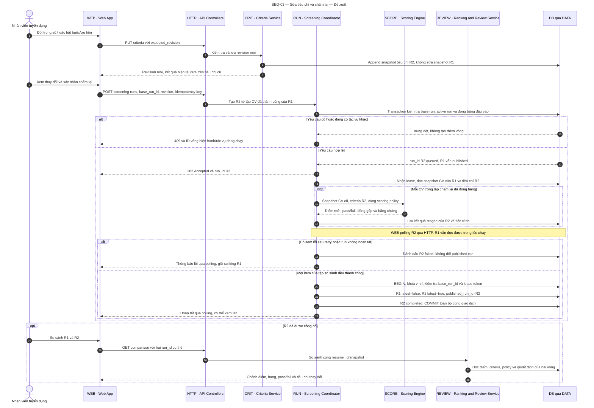

# SEQ-03 — Editing criteria, re-scoring, and comparing two runs

**Status:** proposed behaviour. **Preconditions:** run R1 has been published and reusable CV snapshots exist. **Outcome:** R2 has its own criteria set while R1 remains intact; the user can compare scores, ranks, mandatory-criteria status, and the reason each result changed.

[Open the SVG](diagrams/sequence-03-rescore.svg) to zoom in or embed it in a report.

## Rules and exceptions

The component names match C3; the database is reached through DATA. A solid line is a call and a dashed line a result; responses to WEB are collapsed through HTTP. `alt` is a choice, `loop` an iteration, and `opt` a part that only occurs when its condition holds.

- Re-scoring after a criteria edit uses **exactly the successful CV set and extraction snapshots of the original run**, without calling the AI again. CVs that failed in the first run need a new screening pass to upload or reprocess them; they are not mixed into this R1–R2 comparison.
- Changing the model, the CV version, or the scoring policy constitutes a new kind of evaluation and must not be labelled "criteria change only". This design keeps the policy fixed throughout this flow.
- R1 does not lose its current-run flag the moment re-scoring is requested. All flags and `published_run_id` move together only when the R2 result qualifies for publication. If the transaction fails, the rollback leaves R1 unchanged.
- One active run per position; revision and run IDs must be validated server-side. A retry with the same idempotency key does not create an R3. The lease token prevents an old process from publishing after the job has been reclaimed by another process.
- If the user keeps editing criteria while R2 is running, R2 still uses the snapshot that was fixed at submission. The interface must report when the latest revision differs from the revision behind the results just published.
- Every shortlist/reject decision from R1 is kept in history; R2 starts in the `scored` state so the user reconsiders. Decisions are never transferred automatically on the basis of a new score.
- "Docker becomes mandatory and a candidate therefore moves to not-passed" is a business case that must be tested. The sample figures 92 → 86 and 31 → 19 in the prototype are not commitments made by the implemented formula.

Related: [snapshots and transactions in arc42](arc42.md#8-cross-cutting-concepts).
