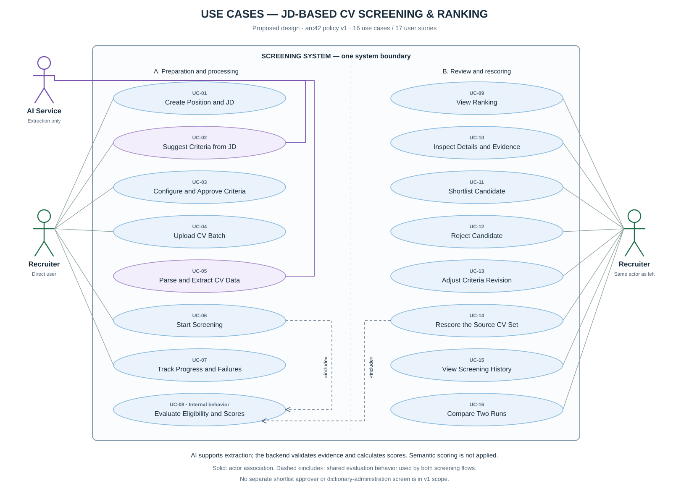

# Use Cases — JD-based CV Screening and Ranking

Version 2.2 · 2026-09-15 · Proposed design derived from [arc42](../architecture/arc42.md) and the [17 INVEST user stories](README.md).

## Actors and system boundary

- **Recruiter:** direct user who creates the JD, approves criteria, uploads CVs, requests screening, reviews results, and records decisions.
- **AI Service:** external supporting system that extracts JD/CV data. The backend validates its output, calculates scores, and produces explanations from calculated results.
- **System under design:** the complete screening subsystem, including the web app, backend, and storage. The scoring engine, dictionary, and database are internal components rather than UML actors.

The diagram uses two groups inside one system boundary for readability. Both Recruiter figures represent **the same actor type**, not separate roles. Solid lines show actor associations and dashed `include` arrows show shared behavior; arrows do not represent chronological order.

## Catalog and traceability

These UC identifiers are stable for this documentation set and do not correspond to the former generator keys `u1`…`u11`. The “Alternate/error flow” column points to behavior that the backlog acceptance criteria must cover.

| ID | Use case / participating actor | Preconditions | Successful outcome | Alternate/error flow | User stories |
|---|---|---|---|---|---|
| UC-01 | Create position and JD / Recruiter | Position name and JD are available | Original JD is stored and the position starts in `draft`; stored lifecycle status is visible/filterable | Missing input; save failure; no lifecycle transition control in v1 | US-01 |
| UC-02 | Suggest criteria from JD / Recruiter, AI Service | Position has a JD | Unapproved draft criteria are returned | AI failure/unsupported evidence; manual entry through UC-03 | US-02 |
| UC-03 | Configure and approve criteria / Recruiter | Position exists | A valid approved criteria revision | Validation failure; review suggestions or enter manually | US-03 |
| UC-04 | Upload CV batch / Recruiter | Position exists | Valid files receive identifiers; duplicates/versions are distinguished | Size/count/format error; duplicate file | US-04, US-05 |
| UC-05 | Parse and extract CV data / AI Service supports | File has been accepted | Validated data and evidence | Corrupt/scanned PDF; invalid extracted data/evidence | US-06 |
| UC-06 | Start screening / Recruiter | Approved criteria and valid CVs | One run with immutable input snapshots | Missing prerequisites; repeated request; active run exists | US-07 |
| UC-07 | Track progress and failures / Recruiter | Screening run exists | Current status and success/failure counts | Connection/process interruption; no successful CV | US-08 |
| UC-08 | Evaluate mandatory criteria and calculate scores / internal behavior | Valid snapshots | Eligibility, score, contributions, and reasons under policy v1 | Insufficient evidence remains distinct from processing failure | US-09, US-10 |
| UC-09 | View ranking / Recruiter | Position exists | One consistent published-run ranking | No result; a newer run is processing | US-11 |
| UC-10 | Inspect details and evidence / Recruiter | Selected screening result exists | Criteria are verified against the correct CV/run | Source file unavailable; missing evidence | US-12 |
| UC-11 | Shortlist candidate / Recruiter | Current result exists | Shortlisted decision is stored | Mandatory warning; cancel; stale/conflicting update | US-13 |
| UC-12 | Reject candidate / Recruiter | Current result exists | Rejected decision is stored | Cancel; save failure; stale/conflicting update | US-13 |
| UC-13 | Adjust criteria revision / Recruiter | Approved criteria exist | New revision preserves history | Validation failure; stale revision | US-14 |
| UC-14 | Rescore the source CV set / Recruiter | Published source run and approved new criteria | Complete new run is published; old run is preserved | Any required CV fails: current ranking is unchanged | US-15 |
| UC-15 | View screening history / Recruiter | A published run exists | Original snapshots, results, and decisions are readable | Decisions cannot be written to a non-current run | US-16 |
| UC-16 | Compare two runs / Recruiter | Two published runs for one position | Score/rank/eligibility deltas align to CV snapshots | Different position; missing run; CV exists in only one run | US-17 |

## Shared behavior and flow

- UC-04 accepts valid files and then starts UC-05 asynchronously. Rejected or duplicate files do not require extraction. No `include` arrow implies that upload must wait synchronously for AI completion.
- UC-06 creates a run whose processing uses UC-08 for every valid CV snapshot. UC-14 also uses UC-08 against existing snapshots. `UC-06 → UC-08` and `UC-14 → UC-08` are `include` relationships: evaluation is mandatory for a successful screening flow, without implying synchronous execution or execution for rejected input.
- UC-02 is optional assistance before UC-03; the recruiter can enter criteria manually.
- UC-10, UC-11, and UC-12 can be reached from UC-09; UC-10 can also be reached from history. UC-16 becomes available after two runs and is not mandatory during rescoring.
- Progress, history, and comparison are separate user goals. A data or navigation relationship does not automatically imply UML `include` or `extend`.

Detailed execution order is shown in [SEQ-01](../architecture/sequence-01-screening.md), [SEQ-02](../architecture/sequence-02-review.md), and [SEQ-03](../architecture/sequence-03-rescore.md).

## Migration from the former use-case diagram

| Former key/label | Change under arc42 |
|---|---|
| u1 — Create position and JD | UC-01; UC-02 adds criteria suggestion from the JD |
| u2 — Configure criteria and weights | UC-03; approval creates a criteria revision |
| u3 — Upload CVs | UC-04; file acceptance is distinct from asynchronous processing |
| u4 — Parse and extract CV data | UC-05; AI assists while the backend validates data/evidence |
| u5 — Match and score CVs | UC-06 starts a run, UC-07 reports progress, and UC-08 evaluates snapshots |
| u5a — Calculate four component scores | UC-08 uses skill/experience/education under policy v1; semantic is not applied; the backend, not AI, calculates scores |
| u5b — Generate evidence and explanations | UC-05 validates source evidence; UC-08 stores reasons/contributions; UC-10 reads an explanation consistent with the published result |
| u6 — View candidate ranking | UC-09 |
| u7 — View candidate details | UC-10, tied to the correct CV version and run |
| u8 — Shortlist/reject | UC-11 and UC-12 remain separate actions under US-13; no separate hiring-manager approval workflow |
| u9 — Adjust criteria and rescore | UC-13 and UC-14 are separate so saving a revision does not automatically score or publish |
| u10 — Compare two runs | UC-16; UC-15 adds the goal of viewing history |
| u11 — Normalize the skill dictionary | BR-EVD-02 plus versioned alias configuration; no interactive dictionary-administration use case in v1 |
| Hiring Manager, System Administrator | Removed from the v1 diagram under arc42; no additional approval or permission workflow is designed |

## Regenerating the diagram

From the repository root, run `node docs/gen-usecase.js docs/use-case-diagram.svg`. The SVG is embedded in this document. The PNG with the same base name is an exported copy; regenerate both whenever diagram content changes if the PNG remains a distributed artifact.
