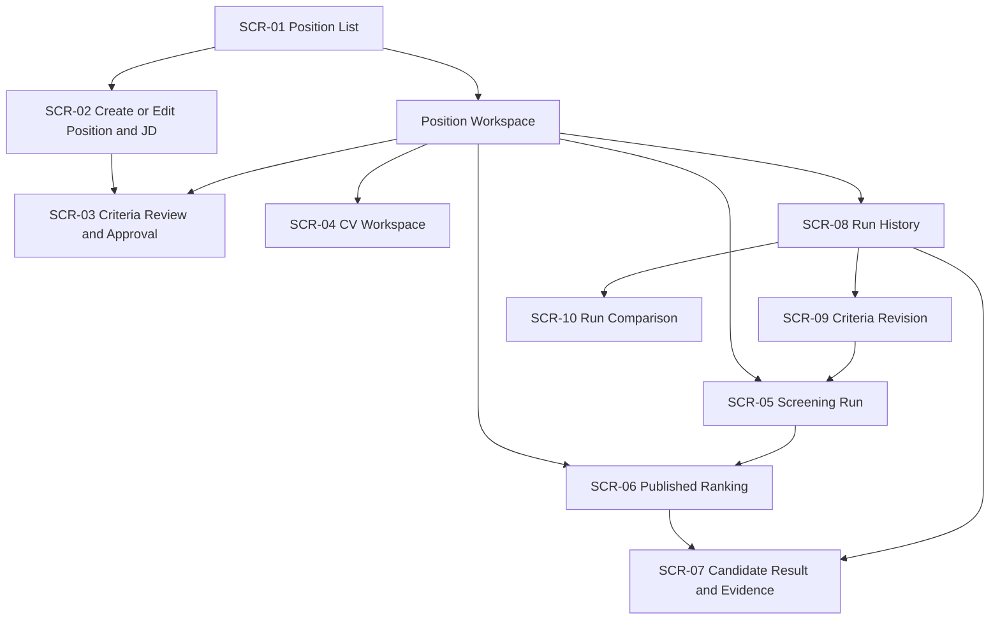

# Screen Hierarchy

Version 1.0 · 2026-09-15

## 1. Target sitemap

The workspace node represents persistent navigation and context, not a separate required route, and it has no screen of its own; see the default-landing rule in section 5. SCR-02 through SCR-10 always belong to one position.

## 2. Screen inventory

Routes are proposed information architecture, not an API contract. Stable screen IDs should be used in designs, tests, and analytics regardless of later route syntax.

| ID | Screen | Proposed route | Parent | Primary stories | Primary use cases |
|---|---|---|---|---|---|
| SCR-01 | Position List | `/positions` | Product | US-01 | UC-01 |
| SCR-02 | Create/Edit Position and JD | `/positions/new`, `/positions/{position}/edit` | Position List | US-01 | UC-01 |
| SCR-03 | Criteria Review and Approval | `/positions/{position}/criteria/draft` | Position Workspace | US-02, US-03 | UC-02, UC-03 |
| SCR-04 | CV Workspace | `/positions/{position}/cvs` | Position Workspace | US-04, US-05, US-06 | UC-04, UC-05 |
| SCR-05 | Screening Run | `/positions/{position}/screening`, `/positions/{position}/runs/{run}` | Position Workspace | US-07, US-08, US-15 | UC-06, UC-07, UC-14 |
| SCR-06 | Published Ranking | `/positions/{position}/ranking` | Position Workspace | US-09, US-10, US-11 | UC-08, UC-09 |
| SCR-07 | Candidate Result and Evidence | `/positions/{position}/runs/{run}/results/{result}` | Ranking or History | US-12, US-13 | UC-10, UC-11, UC-12 |
| SCR-08 | Run History | `/positions/{position}/runs` | Position Workspace | US-16 | UC-15 |
| SCR-09 | Criteria Revision | `/positions/{position}/criteria/revisions/new` | Run History or Criteria | US-14 | UC-13 |
| SCR-10 | Run Comparison | `/positions/{position}/runs/compare` | Run History | US-17 | UC-16 |

### 2.1 Frontend route binding

The routes above are canonical information-architecture paths. The rebuilt frontend is delivered as static files without server rewrites, so it binds each canonical path to a target hash route by prefixing `#`:

| Canonical path | Target hash route |
|---|---|
| `/positions` | `#/positions` |
| `/positions/{position}/criteria/draft` | `#/positions/{position}/criteria/draft` |
| `/positions/{position}/runs/{run}/results/{result}` | `#/positions/{position}/runs/{run}/results/{result}` |

The binding is one rule applied to every row of the inventory, not a second route list to maintain. These are target routes: the existing prototype still uses the Vietnamese hash routes listed in section 6, which the rebuild replaces. The binding is an implementation decision for a static deployment and does not change the information architecture: a later deployment able to rewrite paths may bind the same canonical paths to the History API without changing screen IDs, hierarchy, entry rules, or this document.

## 3. Hierarchy decisions

### Separate position creation from the list

SCR-02 is a real form rather than an alert or inline mock. It provides enough room for the original JD, validation, unsaved-change handling, and a clear transition to criteria extraction/review.

### Keep criteria suggestion and approval together

AI suggestion is a starting state inside SCR-03, not a separate destination. The recruiter can compare proposed criteria with JD evidence, edit them, enter criteria manually after AI failure, and approve revision 1 in one workspace.

### Combine run start and progress

SCR-05 first presents a readiness summary and confirmation. After submission, the same screen becomes the progress/status view for that run. This avoids creating a destination that exists only for one button click.

### Keep candidate detail contextual

SCR-07 always carries position, run, and result context. It is not a primary navigation item and cannot silently fall back to another candidate when a result is unavailable.

### Separate history, revision, and comparison

These are three user goals:

- SCR-08 answers “What happened in each run?”
- SCR-09 answers “What criteria should the next run use?”
- SCR-10 answers “What changed between two published runs?”

They can share layout components but should not be hidden as states of one large page.

## 4. Entry and exit rules

| Screen | Valid entry | Primary exit |
|---|---|---|
| SCR-01 | Product start or back from a workspace | Open/create a position |
| SCR-02 | Create action or edit-position action | Save and continue to SCR-03; cancel to prior context |
| SCR-03 | New/edited JD, workspace Criteria tab, AI failure fallback | Approve and continue to SCR-04; save draft/stay |
| SCR-04 | Approved criteria or workspace CVs tab | Start screening via SCR-05; remain for file recovery |
| SCR-05 | Ready CV set, active run, rescore request, direct run link | Published SCR-06; failed run remains inspectable |
| SCR-06 | Workspace Ranking tab or successful publication | SCR-07, SCR-08, or criteria revision |
| SCR-07 | Candidate/result link from SCR-06 or SCR-08 | Back to the exact source run/ranking context |
| SCR-08 | Workspace Run History tab | Historical SCR-07, SCR-09, or SCR-10 |
| SCR-09 | “Create new revision” from criteria/history | Confirm rescore in SCR-05; cancel without publication |
| SCR-10 | Compare action after selecting two eligible runs | Open either run/result; return to history |

## 5. Guard and fallback rules

- Opening a position-scoped route without a valid position returns to SCR-01 with a clear not-found message.
- Opening a run/result that belongs to another position is rejected; context is never substituted.
- Leaving SCR-02, SCR-03, or SCR-09 with edits prompts to discard or stay.
- Screens with unmet prerequisites remain readable when useful, but their primary action explains what must be completed.
- SCR-06 continues to show the current published run during a newer active run and links to its SCR-05 progress.
- A stale SCR-07 decision attempt remains on the screen, reports the conflict, and offers to load the current published result.

### Default landing order

Opening a position from SCR-01 lands on the **first** matching destination below. The order is fixed so that a position satisfying more than one condition still has exactly one landing screen:

| Order | Condition | Destination |
|---|---|---|
| 1 | A published run exists | SCR-06, with a banner to SCR-05 when a newer run is also active |
| 2 | An active run exists and nothing is published yet | SCR-05 |
| 3 | An approved criteria revision and at least one CV ready for screening | SCR-05 |
| 4 | An approved criteria revision without a CV ready for screening | SCR-04 |
| 5 | No approved criteria revision | SCR-03 |

A published run always takes precedence over an active run: the usable published ranking is never replaced by a progress screen, which is the same guarantee the preceding SCR-06 rule makes. The row action in SCR-01 and this order must always agree.

## 6. Relationship to the current prototype

The current seven screens can migrate into this hierarchy:

| Current route | Target destination |
|---|---|
| `#vi-tri` | SCR-01; creation moves into SCR-02 |
| `#tieu-chi` | SCR-03; original JD editing starts in SCR-02 |
| `#tai-cv` | SCR-04 |
| `#tien-trinh` | SCR-05 |
| `#ket-qua` | SCR-06 |
| `#chi-tiet/:id` | SCR-07 with explicit run/result context |
| `#chinh-tieu-chi` | Split into SCR-08, SCR-09, and SCR-10 |

This mapping guides a later frontend change. It does not require preserving the current hash routes or page composition.

Back to the [UI/UX index](README.md).
