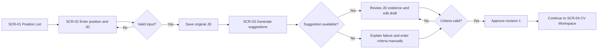
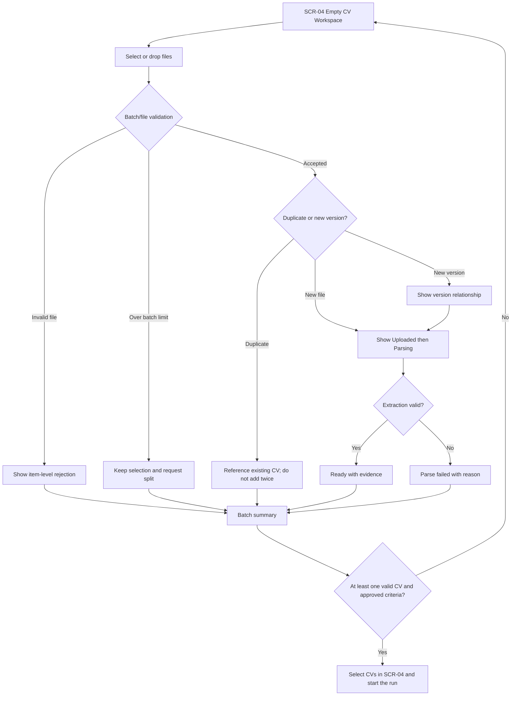
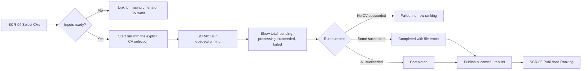
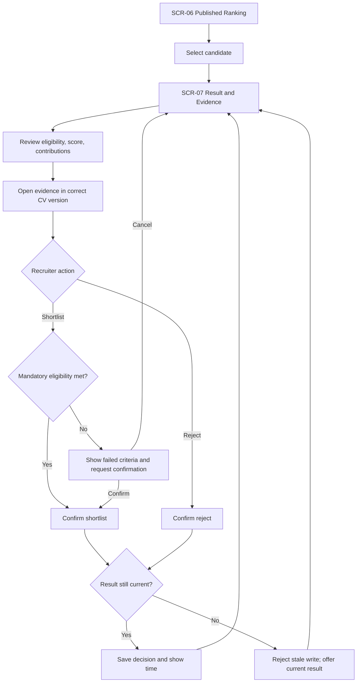
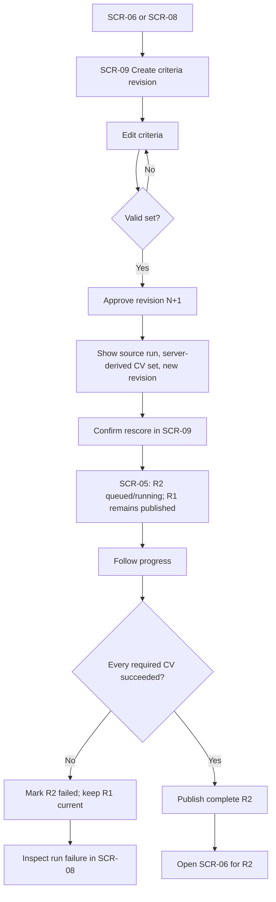
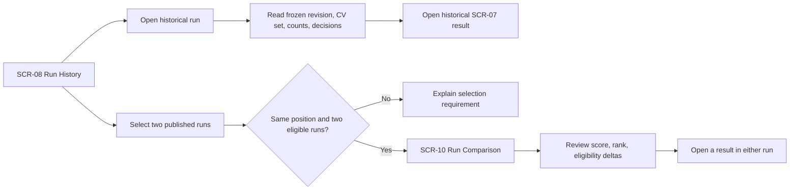

# User Flows

Version 1.0 · 2026-09-15

The flows describe recruiter-visible behavior. Background jobs, transactions, leases, and service calls remain in the architecture sequence diagrams.

## UF-01 — Position, JD, and initial criteria approval

**Goal:** produce approved criteria revision 1 from a new position.

| Step | Screen | Required UI behavior | Requirements |
|---|---|---|---|
| Enter/save JD | SCR-02 | Preserve entered content on validation/save failure | US-01 |
| Suggest criteria | SCR-03 | Draft status; evidence source; manual fallback | US-02, BR-EVD-01 |
| Review/approve | SCR-03 | Inline validation summary; approval confirmation; revision label | US-03, BR-CRI-01, BR-CRI-02, BR-CRI-03, BR-CRI-04, BR-CRI-05 |

## UF-02 — Upload and prepare CVs

**Goal:** create a transparent, screenable CV set.

Key rules:

- Keep accepted, rejected, duplicate, new-version, parsing, ready, and failed outcomes distinct.
- Show counts based on actual items, not the number initially selected.
- A parse failure offers only capabilities that exist in v1; do not offer working OCR.
- Candidate identity ambiguity is a review state and never resolves from name alone.

## UF-03 — Initial screening and publication

**Goal:** publish a ranking for successful items while disclosing technical failures.

The run is created by SCR-04, and SCR-05 is opened for the run that already exists; it never submits one. Repeated start actions do not create multiple logical runs, because the start command carries an idempotency key. Reloading or returning to SCR-05 resumes the same visible run. A failed file remains distinct from failed mandatory eligibility.

## UF-04 — Review evidence and record a decision

**Goal:** make a human decision after inspecting the correct result.

Decision feedback never changes or hides eligibility, score, or evidence. A successful decision is announced in the screen and remains visible after returning to the ranking.

## UF-05 — Adjust criteria and rescore

**Goal:** publish a complete new run while preserving R1 until R2 succeeds.

The confirmation explicitly states that decisions do not carry to R2. Criteria saving alone does not start or publish a run.

## UF-06 — Review history and compare runs

**Goal:** explain past results and understand changes between two runs.

History is Must and remains useful with one run. Comparison is Should and does not block viewing R1 and R2 separately.

## Exception-flow matrix

| Trigger | User-visible response | Recovery destination | Rule/NFR |
|---|---|---|---|
| Position/JD save fails | Preserve input and state that save failed | SCR-02 | US-01.AC-3 |
| Criteria suggestion fails | Preserve JD; allow manual criteria | SCR-03 | US-02.AC-3 |
| Criteria validation fails | Identify affected criteria and rule; do not approve | SCR-03 and SCR-09 | BR-CRI-01, BR-CRI-02, BR-CRI-03, BR-CRI-04, BR-CRI-05 |
| Batch exceeds count limit | Preserve selection; request smaller batches | SCR-04 | US-04.AC-3 |
| One file is invalid | Show file error; continue valid files | SCR-04 | Q03 |
| Screening is interrupted | Resume same run or show terminal failure without duplicates | SCR-05 | Q05 |
| Initial run has partial technical failures | Publish successes with disclosed error count | SCR-06 and SCR-05 detail | BR-RUN-04 |
| Rescore has any required item failure | Keep previous published ranking | SCR-05 and SCR-08 | BR-RSC-02, Q04 |
| CV source preview fails | Keep loaded analysis and show preview error | SCR-07 | US-12.AC-3 |
| Decision view is stale | Do not write; offer current result | SCR-07 | BR-DEC-03, BR-DEC-04, Q06 |
| Only one run exists | History works; comparison explains requirement | SCR-08 | US-16, US-17 |

Back to the [UI/UX index](README.md).
